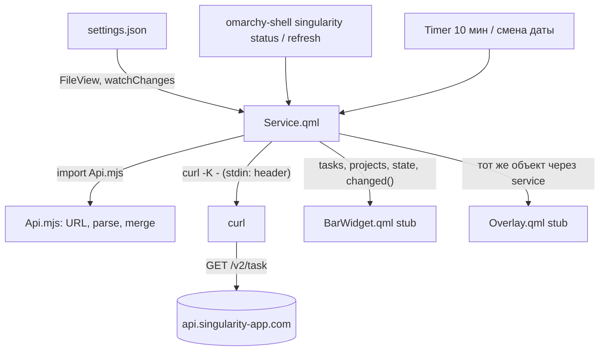

# SNG-1 Каркас плагина - Plan

## Goal Capsule

- **Objective:** каркас плагина `io.github.igorkramar.singularity` для оболочки Omarchy: манифест с тремя `kinds`, headless-сервис, владеющий токеном, опросом API и кэшем, и JS-модуль сборки запросов и разбора ответов без Qt, покрытый тестами в CI. Видимых поверхностей в этой задаче нет.
- **Product authority:** карточка задачи `SNG-1` и карточка проекта `omarchy-singularity` в vault владельца; решения прошлой сессии перенесены в Key Decisions ниже. Поверхности SNG-2…SNG-6 не входят в активный скоуп.
- **Authority:** Product Contract этого файла задаёт поведение; Planning Contract задаёт механизм в его рамках; юниты U1…U4 ниже — порядок работы.
- **Stop conditions:** любой критерий Definition of Done, который нельзя выполнить без токена, помечается как проверенный на подставном токене и остаётся открытым в карточке SNG-1; изменение id плагина или набора `kinds` — стоп и вопрос владельцу.
- **Product Contract preservation:** restructured, no scope change: R3 и F1 — «добавить id в `plugins[]`» заменено на «включить плагин»: у плагина с виджетом штатное включение кладёт запись в раскладку бара, и сервис поднимается по ней.
- **Open blockers:** токена API SingularityApp нет; его заводит владелец (тариф Pro или Elite). До его появления живая проверка опроса невозможна, все остальные требования проверяются без него.

---

## Product Contract

### Summary

Плагин получает единственного владельца состояния: сервис читает токен из файла настроек, опрашивает `/v2/task` по таймеру и держит кэш, который позже будут читать пилюля, попап и оверлей. Сборка URL и разбор ответов живут в отдельном JS-модуле, который тестируется в Node без оболочки.

### Problem Frame

У Todoist-плагина для Omarchy всё состояние лежит в попапе, и счётчик в баре тянет данные отдельным `curl`-процессом. Два источника правды на две поверхности расходятся, а у этого плагина поверхностей три. Если начать с виджета, каждая следующая поверхность будет вынуждена дублировать опрос. Поэтому первой строится не видимая часть, а сервис, и только потом на него садятся поверхности.

### Key Decisions

- **Состояние живёт в headless-сервисе, поверхности только рисуют** (session-settled: user-approved — chosen over хранения состояния в попапе по образцу Todoist-плагина: три поверхности с независимыми запросами разойдутся). Governs R1, R7, R8.
- **Манифест объявляет все три `kinds` сразу, виджет и оверлей идут заглушками** (session-settled: user-approved — chosen over добавления `kinds` по мере появления поверхностей: id и набор поверхностей должны быть окончательными с первой публикации, а плагин без файлов из `entryPoints` не проходит валидацию). Governs R2, R3.
- **Токен передаётся `curl` через stdin, не аргументом** (session-settled: user-approved — chosen over заголовка в аргументах: аргументы видны всей системе через `/proc/*/cmdline`). Governs R10, R11.
- **JS-модуль без Qt, тестируется в Node** (session-settled: user-approved — chosen over логики внутри QML: логику фильтров и разбора нельзя прогнать в CI, если она привязана к оболочке). Governs R4, R5, R6, R13.
- **«Сегодняшнее» = незавершённые с `start` не позже конца текущего дня** (session-settled: user-approved — chosen over выборки по `deadline` или по обоим полям: это поведение `today | overdue` у Todoist, отложенные скрыты, дедлайн покажется меткой в списке). Governs R4.
- **За основу берётся скелет `user.omarchy-notion`, не форк Todoist-плагина** (session-settled: user-directed — chosen over форка: 2134 строки `Panel.qml` ради четырёх изменённых мест невыгодно). Чистое решение о подходе, требований не ограничивает.

### Requirements

**Манифест и загрузка**

- R1. Плагин объявляет `kinds` `service`, `bar-widget`, `overlay` с тремя `entryPoints` и `keepLoaded: true`.
- R2. Все файлы из `entryPoints` существуют; виджет и оверлей в этой задаче ничего не рисуют и не делают запросов.
- R3. `omarchy plugin validate` на каталоге плагина проходит, плагин виден в `omarchy plugin list`, после `omarchy plugin enable` сервис поднимается без ошибок загрузки QML в журнале оболочки.

**Модуль API**

- R4. Модуль собирает URL выборки «сегодня и просрочено»: незавершённые задачи (`checked.eq=0`) с `start.lte` равным концу текущего дня в локальном времени, с разреженным `fields`.
- R5. Модуль разбирает ответ `/v2/task` в плоский список задач с полями, нужными поверхностям: id, название, проект, `start`, `deadline`, приоритет, флаг просрочки.
- R6. Модуль умеет собрать инкрементальный запрос через `modifiedSince` и слить его результат с кэшем (обновлённые заменяются, удалённые и завершённые уходят).

**Сервис**

- R7. Сервис читает токен из `~/.local/state/omarchy/io.github.igorkramar.singularity/settings.json`; без файла или без поля токена выставляет состояние «нет токена» и не падает.
- R8. С токеном сервис опрашивает API по таймеру и держит кэш задач и проектов, доступный другим поверхностям через свойства и сигнал об изменении.
- R9. Ошибка запроса (сеть, не-2xx, невалидный JSON) переводит сервис в состояние «ошибка» с текстом, пригодным для показа, и не стирает последний удачный кэш.

**Безопасность**

- R10. Токен уходит в `curl` только через stdin строкой конфигурации `-K -`.
- R11. Во время запроса токен не появляется в `/proc/<pid>/cmdline` процесса `curl`.
- R12. Файл настроек создаётся или ожидается с правами `0600`; README говорит, как положить токен руками.

**CI и документация**

- R13. CI прогоняет тесты модуля через `node --test`, проверяет валидность манифеста и существование всех файлов из `entryPoints`.
- R14. README описывает установку токена и разработку через симлинк в каталог плагинов.

### Key Flows

- F1. Подъём сервиса
  - **Trigger:** оболочка стартует или перечитывает плагины, плагин включён.
  - **Steps:** сервис читает файл настроек; при наличии токена запускает первый опрос сразу и взводит таймер; при отсутствии остаётся в состоянии «нет токена» и следит за файлом, чтобы подхватить токен без перезапуска.
  - **Outcome:** кэш заполнен или состояние объясняет, почему нет.
  - **Covers R7, R8.**
- F2. Тик опроса
  - **Trigger:** таймер, либо явный запрос обновления от поверхности.
  - **Steps:** если запрос уже идёт, новый не стартует, а помечается как ожидаемый; иначе собирается URL (полный или `modifiedSince`), `curl` получает токен через stdin, ответ разбирается и сливается с кэшем, сигнал уходит подписчикам.
  - **Outcome:** один запрос в полёте, кэш обновлён, ошибка не теряет старые данные.
  - **Covers R4, R6, R8, R9, R10.**

### Acceptance Examples

- AE1. **Covers R7.** Given файла настроек нет, when сервис поднимается, then состояние «нет токена», ошибок в журнале оболочки нет, запросов к API нет.
- AE2. **Covers R9.** Given кэш с пятью задачами и API отвечает 500, when проходит тик, then состояние «ошибка» с текстом, кэш по-прежнему пять задач.
- AE3. **Covers R4.** Given сегодня 2026-09-03, when модуль собирает URL, then в нём `checked.eq=0` и `start.lte=2026-09-03T23:59:59` в локальном смещении, и нет фильтра по `deadline`.
- AE4. **Covers R6.** Given кэш с задачами A и B, when инкрементальный ответ содержит A с `checked: 1` и новую C, then кэш содержит B и C.
- AE5. **Covers R11.** Given идёт запрос, when читается `/proc/<pid>/cmdline` процесса `curl`, then строки `Bearer` в нём нет.

### Scope Boundaries

- Никаких видимых поверхностей: пилюля (SNG-2), попап (SNG-3), оверлей (SNG-4) идут своими задачами.
- Ввода токена через интерфейс нет: токен кладётся в файл руками, экран настройки придёт с попапом.
- Мутации задач (завершить, переименовать, создать) не входят: сервис в этой задаче только читает.
- Привычки, учёт времени, чек-листы не опрашиваются.

### Dependencies / Assumptions

- Токена API нет; форма ответов берётся из открытой спеки `https://api.singularity-app.com/v2/api-json`, тесты модуля работают на примерах, собранных по ней. Живой опрос проверяется владельцем, когда токен появится.
- Оболочка отдаёт сторонний сервис через `serviceFor(pluginId)` и впрыскивает его в панели и оверлеи свойством `service`; проверено чтением `shell.qml`.

### Outstanding Questions

**Deferred to Planning**

- Интервал фонового опроса и стоит ли ускорять его, пока открыта поверхность; у Todoist-плагина 20 минут в фоне.
- Форма заглушек виджета и оверлея: пустой `Item` или минимальная надпись «в разработке».

<!-- ce-section: work-relationships -->
### How This Work Fits Together

Этот план владеет только каркасом: манифестом, модулем API и сервисом. Разбивка ниже отражает текущее понимание порядка сборки, а не обязательство.

- SNG-2 пилюля в баре. Depends on этот план: читает кэш сервиса через `bar.shell.serviceFor(id)`. Still to decide: считать ли просроченной задачу со `start` сегодня и прошедшим временем; показывать ли заметки (`isNote: true`) со `start` в счёте; названия из API рисовать с `textFormat: Text.PlainText`.
- SNG-3 попап. Depends on SNG-2; Enables ввод токена через интерфейс. Still to decide: канал открытия попапа — у плагина с `overlay` `shell.summon(id)` уходит в загрузчик оверлея, а не в виджет бара, так что попап открывается кликом или собственной IPC-целью; и нужен ли при 401 отдельный текст про отозванный токен.
- SNG-4 оверлей. Depends on этот план; Can proceed independently of SNG-2 и SNG-3.
- SNG-5 привычки и время. Depends on SNG-4; Still to decide, какие запросы добавит сервису.
- SNG-6 CLI и хоткей. Depends on SNG-4.

### Sources / Research

- Спека API: `https://api.singularity-app.com/v2/api-json`; параметры `GET /v2/task`, схема `TaskResponseDto`, `modifiedSince`, `fields`.
- Оболочка: `/usr/share/omarchy/shell/shell.qml`, `serviceFor` и `ensureService` около строки 275, впрыск `service` в панели около строки 637; контракт манифеста в `/usr/share/omarchy/shell/README.md`.
- Приём с токеном через stdin: `runAuthedCurl` в `Panel.qml` плагина `io.github.aryan-techie.todoist`, там же чтение `settings.json` через `FileView`.
- Скелет для сервиса: `Service.qml` плагина `ir.message-lock` (свойство `shell`, `IpcHandler`, `Process` со `StdioCollector`).

---

## Planning Contract

### Key Technical Decisions

- KTD1. **`Api.mjs` — ES-модуль, общий для QML и Node.** QML импортирует его строкой `import "Api.mjs" as Api`, Node прогоняет `test/api.test.mjs` через `node --test`; ни одной строки Qt внутри. Проверено на этой машине: `/usr/lib/qt6/bin/qml --apptype core` грузит `.mjs` (Qt 6.11.2), а `qml` из `PATH` — это Qt 5.15 и `.mjs` не грузит; локальные проверки идут бинарём Qt 6. (session-settled: user-approved — chosen over логики внутри QML: её нельзя прогнать в CI.) Governs R4, R5, R6, R13.
- KTD2. **Сервис — единственный владелец состояния, с IPC для безголовой проверки.** `Service.qml` держит `status` (`no-token` / `loading` / `ready` / `error`; имя `status`, а не `state`, — у корневого `Item` свойство `state` уже занято), `errorText`, `tasks`, `projects`, `lastSync` и сигнал `changed`; `IpcHandler` с целью `singularity` отдаёт `status()` (JSON всего перечисленного) и `refresh()`. Так каркас проверяется командой `omarchy-shell singularity status` без единой поверхности. (session-settled: user-approved — chosen over состояния в попапе: три поверхности с независимыми запросами разойдутся.) Governs R7, R8, R9.
- KTD3. **Токен читается `FileView` с `watchChanges: true` и уходит в `curl -K -` через stdin.** Файл `~/.local/state/omarchy/io.github.igorkramar.singularity/settings.json` вида `{"apiToken": "…"}`; слежение за файлом нужно, чтобы токен, положенный руками после старта, подхватился без перезапуска оболочки (F1). Процесс `curl` получает `header = "Authorization: Bearer …"` первой строкой stdin по образцу `runAuthedCurl` из Todoist-плагина. (session-settled: user-approved — chosen over заголовка в аргументах: аргументы видны через `/proc/*/cmdline`.) Governs R7, R10, R11, R12.
- KTD4. **Опрос: полная выборка на старте, при смене даты и по `refresh()`; между ними — инкремент через `modifiedSince`; фоновый таймер 10 минут.** Инкремент не видит задач, которые попали в окно «сегодня» только потому, что наступил новый день, поэтому смена локальной даты принудительно делает полную выборку. Один запрос в полёте: повторный вызов во время запроса ставит флаг «нужен ещё один» и запускается по завершении (приём Todoist-плагина, `refresh()` около строки 531 его `Panel.qml`). Серверные фильтры «сегодня» действуют только в полной выборке: инкремент отдаёт всё изменённое, а отсев по окну «сегодня» делает `merge` на клиенте, иначе завершённые и перенесённые задачи никогда не покинут кэш (сервер их под `checked.eq=0` не вернёт). `since` для инкремента — момент старта предыдущего удачного запроса минус 60 секунд: `merge` идемпотентен по id, а часы клиента и сервера расходятся. `maxCount=1000` выставляется явно (максимум по спеке; умолчание спекой не задано), при ответе ровно в 1000 задач сервис пишет предупреждение в журнал. Интервал 10 минут — умолчание без настройки; вынос в `schema` манифеста — SNG-2. Governs R6, R8.
- KTD5. **Заглушки поверхностей — пустые корневые `Item` с нулевым размером, без обращений к сервису.** `BarWidget.qml` и `Overlay.qml` существуют ради валидации манифеста и загрузки; тот минимальный интерфейс, который оболочка ждёт от оверлея при `summon`, снимается с первопартийного `plugins/emojis/Emojis.qml` на этапе реализации (см. Assumptions). `keepLoaded: true` в манифесте управляет только загрузчиком оверлея (он монтируется на старте, и ошибка QML в заглушке видна в журнале сразу), сервис от флага не зависит; время жизни полноценного оверлея решает SNG-4. (session-settled: user-approved — chosen over добавления `kinds` по мере появления поверхностей: id и набор поверхностей окончательны с первой публикации.) Governs R2, R3.
- KTD6. **Базовый адрес API — `https://api.singularity-app.com`, даты фильтров — локальное время со смещением.** В спеке `servers` пуст, адрес взят с хоста самой спеки. `start.lte` собирается как `YYYY-MM-DDT23:59:59±HH:MM` локальной зоны: спека принимает смещения и нормализует их в UTC. Флаг просрочки — `start` раньше начала текущего локального дня. Governs R4, R5.
- KTD7. **CI остаётся одним джобом `check` на `ubuntu-latest`: `node --test` и штатный валидатор плагина, завендоренный в `test/omarchy-plugin-validate`.** Валидатор Omarchy — 118 строк bash и `jq` без других зависимостей, он проверяет то же, что `omarchy plugin validate` на машине: JSON манифеста, соответствие `kinds` и `entryPoints`, существование файлов, запрещённые namespace id, симлинки. Копия берётся из `/usr/share/omarchy/bin/omarchy-plugin-validate` версии 4.0.0 с комментарием о происхождении; по стабильному адресу в GitHub его нет. `qmllint` в CI не идёт: пакет Qt 6 на раннере тяжёлый, а загрузку QML проверяет только живая оболочка. Governs R3, R13.

### High-Level Technical Design

Значения `status`: `no-token` → (файл с токеном) → `loading` → `ready` | `error`; из `error` следующий удачный тик возвращает в `ready`, кэш при `error` не стирается (R9). Удаление токена из файла возвращает в `no-token` и очищает кэш.

### Assumptions

- Базовый адрес API и формат `settings.json` — по KTD6 и KTD3; живой запрос до появления токена не делался.
- Оболочка вызывает у оверлея при `summon` метод или свойство, которое видно в `plugins/emojis/Emojis.qml`; заглушка копирует минимум оттуда. Если интерфейс окажется шире, заглушка расширяется на месте, в план это не возвращается.
- Ответ `GET /v2/task` без `paginationData` — объект `{ tasks: [...] }`; `maxCount` по умолчанию достаточен для сегодняшних задач, пагинация в этой задаче не реализуется.
- Приёмка на подставном токене: сервер отвечает 401, что проверяет путь ошибки (R9) и путь stdin (R11), но не разбор живого ответа (R5 проверяется тестами модуля на примерах из спеки).
- Спекой не заданы и проверяются только на живом токене: что завершение — это `checked: 1`, а не `complete`; как выглядит `start` у задачи без времени (`useTime: false`) и не даст ли он ложную просрочку; сохраняет ли отложенная (`deferred: true`) задача свой `start`; отдаёт ли сервер `deleteDate` и `removed` при разреженном `fields` вместе с `includeRemoved=true`; как выглядит `start` у генератора повторяющихся задач.

### Sequencing

U1 → U2 → U3 → U4. U3 не зависит от U2 по коду, но проверка загрузки в оболочке имеет смысл только с готовым сервисом.

---

## Implementation Units

### U1. Модуль API и его тесты в CI

- **Goal:** `Api.mjs` собирает URL и разбирает ответы; `node --test` в CI доказывает это без оболочки.
- **Requirements:** R4, R5, R6, R13; AE3, AE4.
- **Dependencies:** нет.
- **Files:** `Api.mjs` (создать), `test/api.test.mjs` (создать), `test/fixtures/task-list.json` и `test/fixtures/project-list.json` (создать, примеры по `TaskResponseDto` и `ProjectResponseDto` из спеки), `.github/workflows/ci.yml` (изменить: шаг `node --test`).
- **Approach:** чистые функции, без состояния и без Qt (KTD1):
  1. `todayQuery(now)` — параметры полной выборки по R4 и KTD6: `checked.eq=0`, `start.lte=<конец дня>`, `maxCount=1000`, `fields=id,title,projectId,start,deadline,priority,checked,deferred,deleteDate,modificatedDate` (поля `removed` в списке разрешённых нет).
  2. `incrementalQuery(since)` — только `modifiedSince=<since минус 60 секунд>`, `includeRemoved=true`, `maxCount=1000` и тот же `fields`; серверных фильтров по `checked` и `start` нет (KTD4).
  3. `buildUrl(base, params)` — сборка со строгим `encodeURIComponent`.
  4. `parseTasks(text)` — из `{tasks}` в плоский список полей R5, `overdue` по KTD6; задачи с `deferred === true` отбрасываются.
  5. `merge(cache, incoming, now)` — по R6: заменить по id, затем отбросить всё, что не проходит предикат «сегодня»: `checked !== 0`, `deleteDate`, `removed === true`, `deferred`, отсутствующий `start` или `start` позже `endOfDay(now)`.
  7. `projectsQuery()` (`fields=id,title`, `maxCount=1000`) и `parseProjects(text)` из `{projects}` в список `{id, title}`.
  6. `endOfDay(now)` / `startOfDay(now)` с локальным смещением.
- **Patterns to follow:** чистые функции без побочных эффектов как в `plugins/services/media/MediaModel.js` оболочки; фикстуры — по полям `TaskResponseDto` из спеки (Sources).
- **Test scenarios:**
  - Covers AE3. Для `now` = 2026-09-03 12:00 локально URL содержит `checked.eq=0`, `start.lte=2026-09-03T23:59:59` с локальным смещением, не содержит `deadline`.
  - `incrementalQuery` содержит `modifiedSince` в формате ISO, сдвинутый на 60 секунд назад от `since`, `includeRemoved=true`, `maxCount=1000` и не содержит `checked.eq` и `start.lte`.
  - `todayQuery` содержит `maxCount=1000` и список `fields` без `removed`.
  - `buildUrl` кодирует `+` в смещении и двоеточия так, что строка разбирается обратно `new URL`.
  - `parseTasks` на фикстуре отдаёт id, title, projectId, start, deadline, priority; задача со `start` вчера помечена `overdue: true`, сегодняшняя — `false`, без `start` — `false`.
  - `parseTasks` на не-JSON бросает ошибку с сообщением, а не возвращает пустой список.
  - Covers AE4. `merge` кэша [A, B] с входящими [A(checked:1), C] даёт [B, C]; входящий с `deleteDate` убирает задачу; входящий `removed: true` убирает задачу; входящий с тем же id заменяет поля.
  - `merge` кэша [A] с входящим A, у которого `start` завтра, даёт пустой кэш; входящий с `deferred: true` не попадает в кэш.
  - `parseTasks` отбрасывает задачу с `deferred: true`; `parseProjects` на фикстуре отдаёт id и title.
  - `endOfDay` на границе полуночи локальной зоны даёт дату того же дня, а не следующего.
- **Verification:** `node --test test/` зелёный локально и в джобе `check`.

### U2. Сервис: токен, опрос, кэш, IPC

- **Goal:** `Service.qml` поднимается в оболочке, читает токен, опрашивает API и отвечает по IPC.
- **Requirements:** R7, R8, R9, R10, R11; F1, F2; AE1, AE2, AE5.
- **Dependencies:** U1.
- **Files:** `Service.qml` (создать).
- **Approach:** по KTD2–KTD4 и KTD6:
  1. Свойства `shell`, `manifest` для впрыска оболочкой; `stateDir` и `settingsPath` как в Todoist-плагине. В `Component.onCompleted` сначала `mkdir -p <stateDir>` (как `mkdirProc` Todoist-плагина) и только по его завершении выставляется `path` у `FileView`: слежение за файлом не взводится, пока нет каталога.
  2. `FileView` на `settingsPath` с `watchChanges: true`, `printErrors: false`; `onLoaded` / `onLoadFailed` / `onFileChanged` ведут в `applySettings(text)`; пустой или битый файл — `no-token`. Ошибка разбора не логируется с содержимым файла: `catch` без вывода `text` и `e.message`, как в `loadSettingsFromText` Todoist-плагина; токен с переводом строки или кавычкой считается отсутствующим (иначе он инъекция в конфиг `curl -K -`). После удачной загрузки непустого токена запускается `chmod 600 <settingsPath>` (R12, образец `chmodProc` Todoist-плагина). Пока `status` = `no-token`, каждый тик таймера вызывает `reload()` у `FileView` — страховка на случай, если слежение за появившимся файлом не сработает.
  3. `Process` для `curl -fsS --max-time 15 -K - <url>` с `stdinEnabled`; в `onStarted` пишется строка заголовка и сразу `stdinEnabled = false` — `curl` читает `-K -` до EOF; `StdioCollector` на stdout и stderr; `onExited` при ненулевом коде — `error` с текстом из stderr или кодом; при нулевом — `Api.parseTasks` в `try/catch`, исключение разбора тоже ведёт в `error` с текстом исключения (R9). Ответ ровно в 1000 задач — предупреждение в журнал (KTD4).
  4. Флаги `inFlight` и `refreshPending`; `Timer` на 10 минут; хранение `lastFullFetchDay` для полной выборки при смене даты.
  5. `IpcHandler { target: "singularity" }` с `status()` и `refresh()`.
  6. Проекты: второй `Process` для `GET /v2/project` (`Api.projectsQuery`) запускается из `onExited` удачного запроса задач той же полной выборки; `inFlight` держится до завершения обоих; `ready` выставляется после задач; ошибка запроса проектов пишется в `errorText`, но `status` не меняет и кэш проектов не стирает. Разбор — `Api.parseProjects`.
- **Execution note:** сначала проверить путь без токена (AE1), затем с подставным токеном (AE2, AE5), только потом таймер.
- **Patterns to follow:** `Service.qml` плагина `ir.message-lock` (свойство `shell`, `IpcHandler`, `Process` + `StdioCollector`); `runAuthedCurl` и `FileView` из `Panel.qml` Todoist-плагина.
- **Test scenarios:** (ручные, через IPC и журнал)
  - Covers AE1. Без `settings.json` и без каталога `~/.local/state/omarchy/io.github.igorkramar.singularity/` (удалить до старта оболочки): `omarchy-shell singularity status` отдаёт `status: no-token`, каталог создан, в журнале оболочки нет ошибок QML, процессов `curl` нет.
  - Файл появляется после старта с `{"apiToken":"fake"}`: без перезапуска сервис переходит в `loading`, затем в `error` с текстом про 401; права файла после загрузки — `600`.
  - Код выхода `curl` 0 и тело не JSON (проверяется подменой URL на страницу с HTML в отладочной сборке или чтением ветки): `status` = `error`, `errorText` содержит текст исключения разбора, кэш не тронут.
  - Битый `settings.json`: `status` = `no-token`, в журнале нет строки с содержимым файла.
  - Covers AE2. С ответом 401 `status` становится `error`, `errorText` непустой, а `tasks` не трогается; поскольку живого кэша до токена нет, отсутствие очистки подтверждается чтением ветки `error` — присваивания `tasks = []` в ней нет.
  - Covers AE5. `omarchy-shell singularity refresh & until pid=$(pgrep -nf api.singularity-app.com); do :; done; tr '\0' ' ' </proc/$pid/cmdline` — процесс отобран по URL, а не по имени (в системе есть чужие `curl`), строки `Bearer` в выводе нет.
  - Два `refresh()` подряд запускают один `curl`, второй — после завершения первого.
  - Удаление токена из файла переводит в `no-token` и очищает `tasks`.
- **Verification:** `omarchy-shell singularity status` отвечает JSON с ожидаемым `status` в трёх сценариях; `journalctl --user -b --since '10 min ago' | grep -i singularity` без ошибок загрузки.

### U3. Заглушки поверхностей, регистрация и проверка загрузки

- **Goal:** плагин валидируется, виден в списке и грузится оболочкой целиком.
- **Requirements:** R1, R2, R3, R13.
- **Dependencies:** U2.
- **Files:** `BarWidget.qml` (создать), `Overlay.qml` (создать), `test/omarchy-plugin-validate` (создать: копия штатного валидатора с комментарием о происхождении), `.github/workflows/ci.yml` (изменить: шаг с валидатором вместо python-проверки манифеста), `manifest.json` (проверить, что `entryPoints` совпадают с файлами).
- **Approach:** по KTD5 и KTD7:
  1. Заглушки — корневой `Item` с нулевыми `implicitWidth` / `implicitHeight`, свойство `service` для впрыска, ничего не рисуют.
  2. Снять с `plugins/emojis/Emojis.qml` минимальный интерфейс оверлея (какой метод зовёт `summon`) и повторить его пустыми функциями.
  3. Локально: `omarchy plugin enable io.github.igorkramar.singularity` — для плагина с `bar-widget` оболочка кладёт запись в раскладку бара, и по ней же (`isEnabled` = запись найдена) поднимает сервис; ручная правка `plugins[]` дала бы `enabled: false` в `omarchy plugin list` при живом сервисе. В README — та же команда.
  4. В CI: `bash test/omarchy-plugin-validate "$PWD"` (нужен `jq`, на `ubuntu-latest` он есть); python-проверка манифеста из первого коммита заменяется этим шагом.
- **Patterns to follow:** манифест `plugins/services/media/manifest.json` оболочки; проверка манифеста уже в `ci.yml`.
- **Test scenarios:**
  - `omarchy plugin validate ~/projects/worktrees/omarchy-singularity/sng-1` без ошибок — валидируется чекаут, а не симлинк: `find` без `-H` печатает стартовую точку-симлинк как найденный линк, и валидатор отвечает «symlinks are not allowed».
  - `omarchy plugin list --json | jq '.[] | select(.id=="io.github.igorkramar.singularity") | .enabled'` даёт `true`; `omarchy-shell shell listPlugins` показывает три `kinds`.
  - После `omarchy plugin enable` в журнале оболочки нет строк `failed to load` для этого id.
  - CI: временно переименованный `Overlay.qml` роняет `bash test/omarchy-plugin-validate "$PWD"` локально.
- **Verification:** три команды выше зелёные, джоб `check` зелёный на ветке.

### U4. README: токен, регистрация сервиса, разработка

- **Goal:** человек ставит плагин и кладёт токен по README без чтения кода.
- **Requirements:** R12, R14.
- **Dependencies:** U3.
- **Files:** `README.md` (изменить).
- **Approach:** раздел Install дополняется тремя шагами: создать `settings.json` с `chmod 600` и `{"apiToken": "…"}`, включить плагин через `omarchy plugin enable io.github.igorkramar.singularity`, проверить `omarchy-shell singularity status`; раздел Development — симлинк для загрузки оболочкой, валидация из корня чекаута (`omarchy plugin validate "$PWD"`, по симлинку валидатор не проходит), `omarchy-shell shell rescanPlugins`, если правка за симлинком не подхватилась, и Qt 6 `qml` для локальной проверки модуля. Статус «in development» остаётся.
- **Test expectation:** none — документация; проверяется прочтением и прогоном шагов на чистом состоянии (`mv settings.json` в сторону и обратно).
- **Verification:** шаги README воспроизводят состояния `no-token` → `error` (подставной токен) на этой машине.

---

## Verification Contract

| Проверка | Команда | Юниты | Признак |
| --- | --- | --- | --- |
| Тесты модуля | `node --test test/` | U1 | все зелёные, в CI тот же шаг |
| Манифест и файлы | джоб `check` в `.github/workflows/ci.yml` (`node --test`, `bash test/omarchy-plugin-validate "$PWD"`) | U1, U3 | зелёный на ветке |
| Валидация плагина | `omarchy plugin validate ~/projects/worktrees/omarchy-singularity/sng-1` | U3 | без ошибок |
| Загрузка | `omarchy plugin list`; `journalctl --user -b --since '10 min ago' \| grep -i singularity` | U2, U3 | id в списке, ошибок загрузки нет |
| Состояния сервиса | `omarchy-shell singularity status` | U2 | `no-token` без файла, `error` с подставным токеном |
| Токен не в аргументах | `omarchy-shell singularity refresh & until pid=$(pgrep -nf api.singularity-app.com); do :; done; tr '\0' ' ' </proc/$pid/cmdline` | U2 | строки `Bearer` нет |
| Права файла токена | `stat -c %a ~/.local/state/omarchy/io.github.igorkramar.singularity/settings.json` | U2 | `600` даже при файле, созданном с umask 022 |
| Модуль грузится QML | `/usr/lib/qt6/bin/qml --apptype core` на пробном файле с `import "Api.mjs"` | U1 | код возврата 0 |

Браузерных тестов нет — поверхностей нет.

---

## Definition of Done

- Все юниты U1–U4 выполнены, каждая строка Verification Contract зелёная на этой машине, джоб `check` зелёный на ветке `feat/sng-1-karkas`.
- Критерии приёмки карточки SNG-1 отмечены, кроме «с токеном — опрашивает API и держит кэш»: он помечен как проверенный на подставном токене до появления живого.
- PR `SNG-1 · Каркас: манифест, Api.js, Service.qml` открыт на `main`; в диффе нет пробных файлов, временных `console.log`, локального `shell.json` и ни одной строки, печатающей содержимое `settings.json`.
- README читается как инструкция для стороннего пользователя, не для автора.
