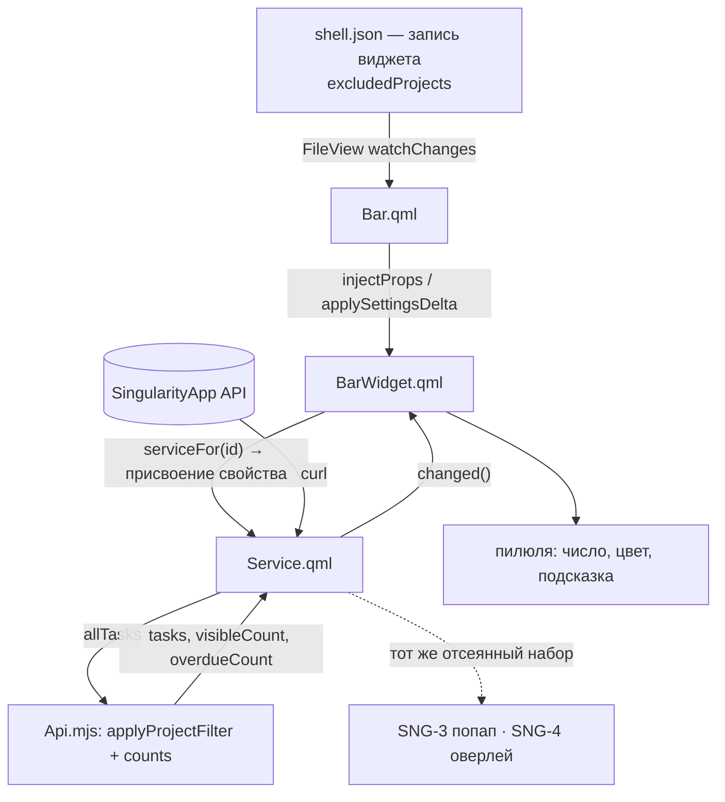

# SNG-2 Пилюля в баре - Plan

## Goal Capsule

- **Objective:** пилюля в баре Omarchy со счётчиком задач окна «сегодня и просрочено» из кэша сервиса, с настраиваемым списком проектов, которые в счёт не идут. Отсев применяется в сервисе и потому действует на весь плагин.
- **Product authority:** карточка `SNG-2` и карточка проекта `omarchy-singularity` в vault владельца. Попап (SNG-3) и оверлей (SNG-4) не входят в активный скоуп, но наследуют отсев.
- **Authority:** Product Contract этого файла задаёт поведение, Planning Contract — механизм в его рамках, юниты U1…U4 — порядок работы.
- **Stop conditions:** менять контракт `Service.qml` за пределами добавления отсева — стоп и вопрос владельцу; трогать поверхности SNG-3 и SNG-4 — стоп.
- **Product Contract preservation:** Product Contract unchanged.
- **Open blockers:** нет. Живой токен есть, сервис работает, окно проверено.

---

## Product Contract

### Summary

Виджет читает кэш сервиса и показывает одно число — сколько задач попадает в окно «сегодня и просрочено» после отсева выбранных проектов. Список исключаемых проектов задаётся настройкой виджета и передаётся в сервис, поэтому счётчик и будущие списки не могут разойтись.

### Problem Frame

Окно «сегодня и просрочено» в этом аккаунте состояло из чужого содержимого. Утром 3 сентября 2026 года в нём было 19 записей: 9 экземпляров сломанного недельного повтора, 8 дней рождения и профессиональных праздников, и только 2 настоящих дела. Число без отсева измеряло не нагрузку, а то, сколько напоминаний накопилось в чужих проектах.

В тот же день дни рождения и праздники уехали в Google Calendar, и окно опустело. Отсев всё равно нужен: следующий шумный проект появится так же незаметно, а править ради него код плагина неправильно. Пустое окно при этом становится обычным состоянием пилюли, а не краем.

### Key Decisions

- **Сервис — единственный владелец состояния, виджет только рисует.** Данные берутся через `bar.shell.serviceFor("io.github.igorkramar.singularity")`; своих запросов к API виджет не делает. (session-settled: user-approved — chosen over собственного опроса в виджете: три поверхности с независимыми запросами разойдутся.) Governs R1, R2.
- **Окно «сегодня» — незавершённые задачи с началом не позже конца текущего дня, отложенные скрыты.** (session-settled: user-approved — chosen over выборки по дедлайну или по обоим полям: это поведение `today | overdue` у Todoist.) Governs R3.
- **Счёт ведётся по окну за вычетом выбранных проектов.** Пользователь отмечает проекты, которые не считать. (session-settled: user-directed — chosen over подсчёта всего окна как есть: 8 записей при нуле настоящих дел измеряют не нагрузку; и chosen over отсева повторяющихся задач: экземпляры сломанного повтора числятся разовыми и не отсеялись бы.) Governs R5, R6.
- **Отсев живёт в сервисе и действует на весь плагин.** Виджет передаёт список сервису, тот применяет его к своему кэшу. (session-settled: user-directed — chosen over отсева только в счётчике: число и список в попапе расходились бы намеренно.) Governs R7, R8.
- **Настройка доступна двумя путями: полем `schema` в манифесте и прямой правкой записи виджета в `shell.json`.** Оболочка Omarchy сама форму по `schema` не рисует — она только собирает схему в метаданные; форму рисует сторонний плагин `plugin-control-center`, которого у пользователя может не быть. Второй путь обязателен, иначе настройка недоступна без чужого плагина. Governs R9, R10.
- **Дата задачи сравнивается в локальной зоне, а не обрезкой строки.** API отдаёт `start` в UTC, и полночь по местному времени приходит как 18:00 предыдущих суток. Взятие первых десяти символов строки сдвигает дату на сутки назад. Governs R15.
- **Пустое окно — нормальное состояние, а не край.** После переезда календаря счёт станет нулевым и останется таким большую часть времени. Governs R11.

### Requirements

**Счёт**

- R1. Виджет получает задачи и проекты из сервиса плагина и не выполняет собственных запросов к API.
- R2. Виджет перерисовывается по сигналу изменения кэша, без опроса по таймеру со своей стороны.
- R3. В счёт идут незавершённые задачи с началом не позже конца текущего локального дня; отложенные не считаются.
- R4. Просроченные — начало раньше начала текущего дня — визуально отличимы от сегодняшних.
- R15. Границы окна и признак просрочки вычисляются переводом `start` в локальную зону; сравнение по текстовому представлению даты недопустимо.

**Отсев проектов**

- R5. Пользователь задаёт список проектов, задачи которых не считаются.
- R6. Задача без проекта считается всегда и отсеву не подлежит.
- R7. Отсев применяется в сервисе, а не в виджете, и распространяется на весь кэш плагина.
- R8. Изменение списка вступает в силу без перезапуска оболочки.

**Настройка**

- R9. Список исключаемых проектов задаётся значением настройки виджета и читается из записи виджета в `shell.json`.
- R10. Манифест объявляет схему настроек, чтобы владельцы `plugin-control-center` получили форму; отсутствие этого плагина не лишает пользователя настройки.

**Состояния**

- R11. При нулевом счёте пилюля показывает состояние «всё чисто», а не пустое место, и остаётся кликабельной для будущего попапа.
- R12. Три нерабочих состояния различимы: нет токена, ошибка запроса, загрузка. У каждого свой вид и подсказка с причиной.

**Оформление и документация**

- R13. Цвета и метрики берутся только из `qs.Commons`; при смене темы пилюля не выбивается из бара.
- R14. README описывает оба способа настройки отсева и то, что форма настроек требует стороннего плагина.

### Key Flows

- F1. Обычный тик
  - **Trigger:** сервис завершил опрос и испустил сигнал изменения.
  - **Steps:** сервис применяет отсев к кэшу; виджет читает число и перерисовывает пилюлю; при неизменном числе перерисовки не происходит.
  - **Outcome:** пилюля отражает текущее состояние без собственных запросов.
  - **Covers R1, R2, R7.**
- F2. Изменение списка проектов
  - **Trigger:** пользователь правит настройку виджета — через форму стороннего плагина или прямо в `shell.json`.
  - **Steps:** оболочка перечитывает файл и передаёт новые настройки живому виджету; виджет передаёт список сервису; сервис пересчитывает отсев и сообщает об изменении.
  - **Outcome:** счёт меняется без перезапуска оболочки.
  - **Covers R5, R8, R9.**

### Acceptance Examples

- AE1. **Covers R5, R7.** Given в окне 8 записей, все из проектов «Дни рождения» и «Праздники и поздравления», when оба проекта внесены в список исключаемых, then счёт равен нулю.
- AE2. **Covers R11.** Given счёт равен нулю, when пилюля отрисована, then она видима, показывает состояние «всё чисто» и остаётся кликабельной.
- AE3. **Covers R6.** Given задача без проекта попадает в окно, when список исключаемых непуст, then задача остаётся в счёте.
- AE4. **Covers R8.** Given оболочка запущена, when список исключаемых меняется в `shell.json`, then счёт меняется без перезапуска.
- AE5. **Covers R12.** Given файла с токеном нет, when пилюля отрисована, then она показывает состояние «нет токена» с подсказкой, где взять токен, и не показывает число.
- AE6. **Covers R4.** Given в окне есть просроченная и сегодняшняя задача, when пилюля отрисована, then просрочка видна отдельно от общего числа.
- AE7. **Covers R15.** Given задача со `start` равным `2026-09-20T18:00:00.000Z` и локальной зоной `+06:00`, when вычисляется её дата, then она считается назначенной на 21 сентября, а не на 20-е, и 21 сентября не помечается просроченной.

### Scope Boundaries

- Попап со списком задач — SNG-3. Пилюля в этой задаче открывает только подсказку.
- Оверлей — SNG-4.
- Любые изменения задач: отметка выполнения, правка, создание. Виджет только читает.
- Ввод токена через интерфейс. Токен по-прежнему кладётся в файл руками.
- Отсев действует, пока пилюля есть в раскладке бара: список доезжает до сервиса только от виджета. Конфигурация «плагин включён, пилюля из бара убрана» отсевом не покрыта — постоянный дом для списка выбирается до оверлея SNG-4.

### Dependencies / Assumptions

- Проверено чтением исходников оболочки: виджет достаёт сервис через `bar.shell.serviceFor(<id>)`; передать настройку сервису можно присвоением свойства объекту сервиса — так делает плагин `mozzy.kaj`; `Ui/BarWidget` даёт `settings` и helper чтения одного значения; правки в `shell.json` подхватываются без перезапуска; ролевой цвет `bar.urgent` (проекция `Color.bar.active`) бар анимирует при смене темы, тогда как глобальный `Color.urgent` переопределение темы обходит.
- Схема настроек в манифесте собирается оболочкой в метаданные, но штатного экрана, который её рисует, в Omarchy нет — это единственное расхождение с исходной постановкой задачи.
- Подтверждено на живых данных 03.09.2026: все задачи без времени приходят со `start` в 18:00 UTC, что в зоне `+06:00` есть полночь следующего дня. Ошибка обрезки строки уже произошла один раз при переносе 34 записей в Google Calendar — все даты уехали на сутки назад и правились отдельно.
- Проверить визуальное отличие просроченного от сегодняшнего на живых данных сейчас нельзя: после переезда календаря окно пусто. Проверяется подстановкой даты.

### Outstanding Questions

Обе отложенные развилки закрыты планированием — см. KTD2 и KTD3. Открытых вопросов, блокирующих реализацию, нет.

<!-- ce-section: work-relationships -->
### How This Work Fits Together

Этот план владеет пилюлей и механизмом отсева. Разбивка отражает текущее понимание порядка сборки, а не обязательство.

- SNG-3 попап. Depends on этот план: показывает тот же отсеянный набор; Still to decide — канал открытия, поскольку у плагина с оверлеем вызов уходит в оверлей, а не в виджет.
- SNG-4 оверлей. Depends on SNG-1; Shares с этим планом отсев проектов; Still to decide — постоянный дом списка исключаемых: запись виджета в `shell.json` или собственный `settings.json` сервиса. Оверлей вызывается хоткеем и не требует пилюли в баре, а сейчас список доезжает до сервиса только от неё.
- SNG-5 привычки и время. Can proceed independently of этого плана.
- SNG-6 CLI и хоткей. Depends on SNG-4.

### Sources / Research

- Живые данные на 03.09.2026: окно «сегодня и просрочено» пусто после переезда дней рождения и праздников в Google Calendar; утром в нём было 19 записей, днём 8.
- Смещение дат: 34 из 34 перенесённых записей хранились со `start` в 18:00 UTC; при переводе в зону `+06:00` дата сдвигается на следующий день.
- Оболочка: `Ui/BarWidget.qml` (базовый тип и helper настроек), `plugins/bar/Bar.qml` (впрыск настроек в живой виджет и контракт попапа), `shell.qml` (доступ к сервису, перечитывание конфигурации), `Commons/Color.qml` и `Commons/Style.qml` (цвета и метрики бара).
- Образцы: `plugins/services/media/BarWidget.qml` — виджет поверх сервиса; `mozzy.kaj` — передача настроек в сервис присвоением по трём триггерам; `io.github.aryan-techie.todoist` — счётчик в баре, подсказка, ширина по содержимому и раскладка для вертикального бара.
- Ревью плана 03.09.2026, три ревьюера: связность, реализуемость, состязательный. Поймано в том числе ложное обоснование KTD1 про единственного потребителя `tasks`, невыполнимые сценарии U2 и привязка регрессии к зоне при прогоне CI в UTC.

---

## Planning Contract

### Key Technical Decisions

- KTD1. **`tasks` у сервиса становится отсеянным видом, полное окно живёт во внутреннем `allTasks`.** Так «отсев действует на весь плагин» выполняется само собой: любая поверхность, читающая `tasks`, видит одно и то же множество, а исходные данные не теряются и повторный запрос при смене фильтра не нужен. Смена смысла существующего свойства требует переноса трёх внутренних потребителей `tasks` в `Service.qml`: база слияния `Api.merge`, тихий гейт сравнения с прежним набором и вывод `IpcHandler.status()`. Не перенести их — значит сливать инкремент поверх отсеянного набора, и очистка фильтра не вернёт задачи до суточного полного опроса. Внешний потребитель пока один — заглушка `BarWidget.qml`. (session-settled: user-directed — chosen over отсева только в счётчике: число и список в попапе расходились бы.) Governs R7, R8.
- KTD2. **Проекты в настройке хранятся названиями, а не идентификаторами.** Ручная правка `shell.json` — обязательный путь настройки (R9, R10), а идентификатор вида `P-81478cf7-…` человек в файле не напишет. Сравнение по обрезанной строке без учёта регистра. Плата тройная: переименование проекта тихо выключает отсев для него; правило срабатывает на всех одноимённых проектах разом (уникальности названий спецификация не обещает); исключение родителя не распространяется на подпроекты, потому что проекты в SingularityApp иерархичны. Всё три случая видны по неожиданному числу и правятся строкой в файле. Governs R5, R9.
- KTD3. **Пилюля показывает одно число; просрочка передаётся ролевым цветом бара и разбивкой в подсказке.** Ширина виджета в баре ничем не ограничена и выводится из содержимого, так что второе число технически поместилось бы — одно число это выбор плотности бара, а не следствие лимита. Различимость даёт цвет `bar.urgent` (ролевая проекция `Color.bar.active`, которую бар анимирует при смене темы) плюс разбивка «просрочено N, сегодня M» в подсказке. Governs R4, R12.
- KTD4. **Виджет передаёт список сервису по трём триггерам: появление сервиса, изменение настроек, завершение загрузки.** Двух мало: `bar` впрыскивается отложенно, поэтому на момент создания виджета `serviceFor` ещё вернёт пусто, а сам сервис может быть создан позже. Сервис берётся привязкой к `bar.shell.serviceFor(<id>)`, и присвоение делается в обработчике изменения этой привязки — приём из плагина `mozzy.kaj`, где рядом стоят все три. Governs R1, R8.
- KTD5. **Логика отсева и подсчёта живёт в `Api.mjs` чистыми функциями, а не в QML.** Тот же довод, что в SNG-1: в QML эта логика не покрывается `node --test`, а именно она определяет число, которое видит пользователь. Governs R3, R15.
- KTD6. **Требование о локальной зоне (R15) уже выполнено существующим кодом; юнит добавляет регрессию, а не логику.** `Api.mjs` сравнивает моменты времени объектами `Date` (`isCurrent`, `overdue` в `normalizeTask`), а не текстовые представления дат, поэтому сдвига на сутки в плагине нет. Сдвиг, случившийся при переносе календаря, произошёл в разовом скрипте миграции. Governs R15.

### High-Level Technical Design

Состояния пилюли соответствуют `status` сервиса: `no-token` — значок без числа и подсказка про файл токена; `loading` при пустом кэше — значок ожидания; `error` — значок ошибки и текст в подсказке; `ready` — число, где ноль показывается как «всё чисто» (R11), а не скрывается.

### Assumptions

- Настройка виджета читается из его записи в раскладке бара; при отсутствии ключа отсев пуст и считается всё окно.
- Отсев по названиям требует непустого кэша `projects`: в задаче лежит только `projectId`, сопоставлять название не с чем. Пустой кэш — это состояние «отсев не применён», а не рабочее. Кэш наполняется хвостом полного опроса, то есть на старте, при смене суток и по `refresh`.
- Живая проверка отсева требует задачи в окне: сейчас окно пусто, поэтому проверка идёт на временной задаче, созданной и удалённой в рамках прогона.

### Sequencing

U1 → U2 → U3 → U4. U3 требует U2, потому что читает новые свойства сервиса; U4 документирует то, что появилось в U2 и U3.

---

## Implementation Units

### U1. Отсев и счётчики в `Api.mjs`

- **Goal:** чистые функции, которые по окну и списку исключаемых проектов дают отсеянный набор и два числа.
- **Requirements:** R3, R5, R6, R15; KTD2, KTD5, KTD6.
- **Dependencies:** нет.
- **Files:** `Api.mjs` (изменить), `test/api.test.mjs` (изменить).
- **Approach:**
  1. `normalizeExcluded(list)` — из значения настройки делает набор сравнимых ключей: обрезка пробелов, приведение регистра, отбрасывание пустых строк; принимает массив и строку с запятыми, потому что руками в JSON пишут и так и так.
  2. `applyProjectFilter(tasks, projects, excluded)` — оставляет задачу, если её проект не в наборе; задача без проекта остаётся всегда (R6). Сопоставление идёт через `projects` по названию, поскольку в задаче лежит идентификатор.
  3. `countWindow(tasks, now)` — возвращает `{ total, overdue }`, где `overdue` вычисляется из `start` и `now` тем же сравнением, что в `normalizeTask`, а не читается из признака, замороженного при разборе ответа. Иначе после полуночи раскладка остаётся вчерашней до ближайшего полного опроса, а параметр `now` оказывается декоративным.
- **Patterns to follow:** существующие чистые функции `merge`, `isCurrent`, `parseTasks` в `Api.mjs`; форма тестов из `test/api.test.mjs`.
- **Execution note:** регрессию на локальную зону писать первой и убедиться, что она проходит на текущем коде — она фиксирует уже верное поведение, а не чинит его. Прогон требует фиксированной зоны: `TZ=Asia/Almaty node --test`, иначе на раннере в UTC утверждение про 21 сентября ложно и джоб краснеет.
- **Test scenarios:**
  - Covers AE7. Задача со `start` `2026-09-20T18:00:00.000Z` при зоне `+06:00` относится к 21 сентября: 21-го она не просрочена, 22-го просрочена.
  - Covers AE3. Задача без проекта остаётся в наборе при непустом списке исключаемых.
  - Covers AE1. Все задачи двух исключённых проектов уходят, счёт становится нулевым.
  - Исключение по названию с другим регистром и лишними пробелами срабатывает.
  - Название, которого нет ни у одного проекта, не роняет функцию и ничего не отсеивает.
  - Настройка, пришедшая строкой с запятыми, даёт тот же результат, что массив.
  - `countWindow` на смеси просроченных и сегодняшних даёт верные `total` и `overdue`.
  - Один и тот же набор задач при `now` вчера и при `now` сегодня даёт разные `overdue` — признак не заморожен.
  - Два разных проекта с одинаковым названием исключаются оба: правило по названию не различает их.
  - Пустой список исключаемых возвращает исходный набор той же длины.
- **Verification:** `node --test` зелёный; число тестов выросло с 11.

### U2. Отсев в сервисе

- **Goal:** сервис хранит полное окно отдельно, отдаёт отсеянный набор и счётчики, пересчитывает их при смене настройки.
- **Requirements:** R7, R8; KTD1, KTD4, KTD5.
- **Dependencies:** U1.
- **Files:** `Service.qml` (изменить).
- **Approach:**
  1. Внутреннее `allTasks` получает результат слияния; `tasks` становится производным отсеянным видом. Вместе с этим на `allTasks` переводятся база `Api.merge` и тихий гейт сравнения с прежним набором — иначе инкремент сольётся поверх отсеянного кэша.
  2. Свойство `excludedProjects` со значением по умолчанию — пустой список; его выставляет виджет.
  3. Функция пересчёта вызывается в трёх местах: после удачного опроса задач, после удачного получения проектов и при изменении `excludedProjects`. Третье место обязательно, потому что проекты приезжают хвостом после задач, и на первом полном опросе отсев считался бы при пустой карте названий. Пересчёт обновляет `tasks`, `visibleCount`, `overdueCount` и испускает `changed()` только при фактическом изменении набора, сохраняя приём из SNG-1.
  4. Признак применимости: пока `excludedProjects` непуст, а `projects` пуст, сервис держит флаг «отсев не применён» и не выдаёт число за отсеянное. Изменение `excludedProjects` при пустой карте проектов взводит полную выборку, чтобы карта появилась.
  5. `IpcHandler` дополняется чтением — `status()` отдаёт `visibleCount`, `overdueCount`, `excludedProjects` и флаг применимости — и записью `exclude(names)`, которая выставляет список и запускает пересчёт. Без записи сценарии этого юнита невыполнимы: до U3 выставить список больше нечем, а править значение по умолчанию в QML значит тащить отладку в дифф.
- **Patterns to follow:** существующий «тихий» гейт вокруг `changed()` в `taskProc.onExited`; форма свойств и `IpcHandler` в текущем `Service.qml`.
- **Test scenarios:** (ручные, через IPC — QML вне `node --test`)
  - `omarchy-shell singularity status` отдаёт `visibleCount`, `overdueCount`, `excludedProjects` и флаг применимости.
  - При пустом `excludedProjects` `visibleCount` равен числу задач окна.
  - `omarchy-shell singularity exclude "<проект с задачей в окне>"` уменьшает `visibleCount`, укорачивает `tasks`, испускает `changed()`.
  - `omarchy-shell singularity exclude ""` возвращает прежние значения — проверка того, что инкремент не сливался поверх отсеянного набора.
  - Название, которого нет ни в одном проекте, оставляет счёт прежним и поднимает флаг «отсев не применён».
- **Verification:** три состояния `status` по-прежнему работают; в журнале оболочки нет ошибок QML.

### U3. Пилюля

- **Goal:** видимый виджет со счётчиком, цветом просрочки, подсказкой и тремя нерабочими состояниями.
- **Requirements:** R1, R2, R4, R11, R12, R13; KTD3, KTD4.
- **Dependencies:** U2.
- **Files:** `BarWidget.qml` (заменить заглушку).
- **Approach:**
  1. Корень остаётся `Ui/BarWidget` — попапа в этой задаче нет, контракт `open/close/opened` не нужен.
  2. Сервис берётся привязкой к `bar?.shell?.serviceFor(pluginId)` с проверкой, что функция существует. Пока сервис не разрешён — `bar` ещё не впрыснут или сервис не создан — пилюля показывает ожидание, а не ошибку: состояние ошибки закреплено за `status === "error"` сервиса (R12), и мигание им на каждом старте расходится с этим смыслом.
  3. Настройка читается helper'ом базового типа и передаётся сервису по трём триггерам из KTD4: изменение привязки к сервису, изменение настроек, завершение загрузки.
  4. Отрисовка: значок плюс число; цвет числа — `bar.urgent`, когда `overdueCount` больше нуля, иначе цвет переднего плана бара; метрики только из `Style.bar`. В вертикальном баре рисуется только значок, число уходит в подсказку, а размер задаётся высотой вместо ширины — базовый тип отдаёт признак `vertical`, и оба образца это учитывают.
  5. Подсказка собирается по состоянию: причина для нерабочих, разбивка «просрочено N, сегодня M» для рабочего, «всё чисто» при нуле. При поднятом флаге «отсев не применён» подсказка называет это прямо, чтобы завышенное число не выглядело отсеянным.
- **Patterns to follow:** `plugins/services/media/BarWidget.qml` — виджет поверх сервиса; `mozzy.kaj/BarWidget.qml` — передача настроек в сервис; `io.github.aryan-techie.todoist/BarWidget.qml` — счётчик и подсказка в баре.
- **Test scenarios:** (живая проверка в оболочке)
  - Covers AE5. Без файла токена пилюля показывает состояние «нет токена» с подсказкой и без числа.
  - Covers AE2. При нулевом счёте пилюля видима и показывает «всё чисто».
  - Covers AE6. При задаче в окне с просроченной датой число окрашено `urgent`, подсказка называет разбивку.
  - После `omarchy theme set` на другую тему цвета пилюли меняются вместе с баром.
  - В вертикальном баре пилюля не обрезается и не выдавливает соседей: число ушло в подсказку.
  - На старте оболочки пилюля не мигает состоянием ошибки, пока сервис ещё не разрешён.
  - Виджет не запускает `curl`: во время тика единственный процесс с запросом принадлежит сервису.
- **Verification:** пилюля видна в баре после включения плагина; журнал оболочки без ошибок загрузки.

### U4. Настройка в манифесте и README

- **Goal:** отсев настраивается обоими путями, и оба описаны.
- **Requirements:** R9, R10, R14; KTD2.
- **Dependencies:** U3.
- **Files:** `manifest.json` (изменить), `README.md` (изменить), `.github/workflows/ci.yml` (проверить, что валидатор пропускает новый манифест).
- **Approach:**
  1. В `barWidget` добавляются `defaults` с пустым списком и `schema` с одним полем — список названий проектов; описание поля говорит, что это названия, а не идентификаторы.
  2. Описание виджета в манифесте приводится в соответствие: сейчас оно обещает попап, которого в этой задаче нет.
  3. README получает раздел про отсев: правка записи виджета в `shell.json` как основной путь, форма стороннего `plugin-control-center` как дополнительный, явная оговорка про отсутствие штатного экрана настроек, и строка о том, что правило по названию срабатывает на всех одноимённых проектах и не наследуется подпроектами.
  4. Шагу `node --test` в `.github/workflows/ci.yml` задаётся зона `TZ: Asia/Almaty` — без неё регрессия на смещение падает на раннере в UTC.
  5. `defaults` в манифесте остаются метаданными для формы стороннего плагина: в рантайм виджету приходит ровно запись из `shell.json`, поэтому пустой список по умолчанию обеспечивает helper базового типа, а не манифест.
- **Test expectation:** none — манифест и документация; проверяется валидатором и прочтением.
- **Verification:** `bash test/omarchy-plugin-validate "$PWD"` без ошибок; правка списка в `shell.json` меняет счёт без перезапуска оболочки; джоб `check` зелёный с заданной зоной.

---

## Verification Contract

| Проверка | Команда | Юниты | Признак |
| --- | --- | --- | --- |
| Тесты модуля | `TZ=Asia/Almaty node --test` | U1 | все зелёные, число тестов выросло с 11 |
| Манифест и файлы | `bash test/omarchy-plugin-validate "$PWD"` | U4 | код возврата 0 |
| CI | джоб `check` на ветке | U1, U4 | зелёный |
| Состояние сервиса | `omarchy-shell singularity status` | U2 | есть `visibleCount`, `overdueCount`, `excludedProjects`, флаг применимости |
| Отсев вживую | создать задачу со стартом сегодня **в существующем проекте**, снять `visibleCount`; внести его в `excludedProjects` в `shell.json`; снять снова; вернуть список пустым; удалить задачу | U2, U3, U4 | счёт падает до нуля и возвращается, оболочка не перезапускалась |
| Пилюля | глазами в баре в четырёх состояниях | U3 | число, цвет, подсказка соответствуют состоянию |
| Тема | `omarchy theme set <другая>` | U3 | цвета пилюли меняются вместе с баром |

Окно сейчас пусто, поэтому живая проверка отсева идёт на временной задаче: она создаётся и удаляется в рамках прогона, в приложении следов не остаётся. Проект для неё берётся существующий — у только что созданного не будет записи в кэше `projects`, и счёт не изменился бы по причине, не связанной с кодом.

---

## Definition of Done

- Юниты U1–U4 выполнены, каждая строка Verification Contract зелёная, джоб `check` зелёный на ветке `feat/sng-2-pilyulya`.
- Критерии приёмки карточки SNG-2 отмечены; пункт «со звёздочкой» закрыт: настройка доступна из основного скоупа полем `schema` в манифесте (форму рисует сторонний `plugin-control-center`) и прямой правкой `shell.json`. Штатного экрана настроек у Omarchy нет.
- PR открыт на `main`, в диффе нет временной задачи, отладочных строк и локального `shell.json`.
- README описывает оба пути настройки и отсутствие штатного экрана настроек у оболочки.
