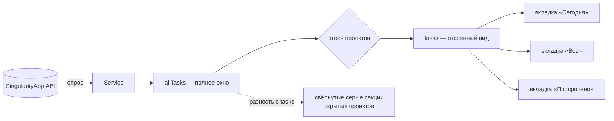

# SNG-3 Попап со списком задач - Plan

## Goal Capsule

- **Objective:** попап по клику на пилюлю, показывающий то, из чего сложилось её число: задачи окна, сгруппированные по проектам, с тремя вкладками и полным управлением с клавиатуры. Только чтение.
- **Product authority:** карточка `SNG-3` и карточка проекта `omarchy-singularity` в vault владельца, с поправкой: принятый ранее дефолт «клик по пилюле открывает оверлей» отменён решением KD2.
- **Not active scope:** мутации задач — отметка выполнения, инлайн-правка, быстрое добавление — вынесены в отдельную задачу SNG-3.1 и в этом плане не проектируются.
- **Open blockers:** нет.

## Product Contract

### Summary

Попап по клику на пилюлю показывает задачи окна «сегодня и просрочено», сгруппированные по проектам сворачиваемыми секциями. Три вкладки — разрезы одного кэша, отдельных запросов не требуют. Проекты, исключённые отсевом SNG-2, видны свёрнутой серой строкой на своём месте и разворачиваются как обычные. Открытие тянет свежие данные и показывает это.

### Problem Frame

Пилюля SNG-2 отвечает на вопрос «сколько», но не на вопрос «что именно». Число без списка заставляет открывать веб-приложение, то есть уходить из оболочки — ровно то, ради чего плагин и делается.

Отсев проектов усилил разрыв: после него число перестало совпадать с содержимым аккаунта, и без списка невозможно проверить, что скрылось именно то, что задумано. Владелец узнаёт об ошибке в правиле отсева только по неожиданному числу, а причину увидеть негде.

### Key Decisions

- KD1. **Задача несёт только чтение; все мутации уходят в SNG-3.1.** Первые в плагине операции записи получают собственное ревью, а видимый результат приходит раньше. (session-settled: user-directed — chosen over одной задачи вместе с мутациями: карточка описывает их вместе, но запись по живым задачам — отдельный класс риска.)
- KD2. **Клик по пилюле открывает попап; оверлей вызывается хоткеем, меню и CLI.** Отменяет принятый ранее дефолт карточки проекта, отдававший клик оверлею. Governs R1.
- KD3. **Три вкладки — разрезы одного кэша окна, а не разные выборки.** «Все» означает окно целиком, то есть ровно то, что считает пилюля. (session-settled: user-approved — chosen over вкладки «все незавершённые задачи аккаунта»: она потребовала бы второго кэша со своей синхронизацией.) Governs R4, R5.
- KD4. **Исключённые отсевом проекты показываются свёрнутой серой строкой на своём месте.** Отдельный переключатель и четвёртая вкладка при этом не нужны. (session-settled: user-directed — chosen over переключателя в подвале и отдельной вкладки: строка на месте убирает целое состояние.) Governs R10, R11, R12.
- KD5. **Список группируется сворачиваемыми секциями по проектам, вкладки — сегментом над списком.** (session-settled: user-directed — chosen over плоского списка с меткой проекта в строке: группировка названа в постановке задачи, метка её не заменяет.) Governs R6, R7, R8.
- KD6. **Вкладки переключаются клавишами `h` и `l`; `Tab` остаётся базовому типу панели.** Панель ведёт себя так же, как остальные панели бара. (session-settled: user-directed — chosen over `Tab` под вкладки: пришлось бы переучивать уход на соседнюю панель и делать нашу панель исключением.) Governs R14, R15.
- KD7. **Открытие попапа запускает опрос, и это видно.** (session-settled: user-directed — chosen over показа кэша как есть: данные могли устареть на весь интервал опроса, а молчаливое обновление выглядит как самопроизвольное шевеление списка.) Governs R18, R19.

### Requirements

**Открытие и закрытие**

- R1. Клик по пилюле открывает попап; повторный клик и `Esc` его закрывают.
- R2. У попапа есть собственная цель IPC с командами открытия, закрытия и переключения, не пересекающаяся с вызовом оверлея.
- R3. Попап привязан к пилюле того же экрана: на многомониторной конфигурации открывается тот, по которому кликнули.

**Содержимое списка**

- R4. Вкладок три: «Сегодня», «Все», «Просрочено». Все три — разрезы кэша окна; переключение вкладки не порождает запроса к API.
- R5. «Сегодня» показывает задачи окна, не помеченные просроченными; «Просрочено» — только просроченные; «Все» — окно целиком.
- R6. Задачи сгруппированы по проектам. Каждая группа имеет заголовок с названием проекта и числом задач в ней на текущей вкладке.
- R7. Секция сворачивается и разворачивается; состояние свёрнутости сохраняется при переключении вкладок в пределах одного открытия попапа.
- R8. Задачи без проекта собраны в отдельную группу и показываются наравне с остальными.
- R9. Строка задачи несёт название, признак просрочки и, при наличии, дедлайн отдельной меткой. Приоритет передаётся цветом.

**Отсев и скрытые проекты**

- R10. Проект, исключённый отсевом SNG-2, показан свёрнутой строкой на своём месте в списке, визуально отличимой от обычной секции.
- R11. Скрытая секция разворачивается тем же способом, что обычная, и показывает свои задачи.
- R12. Задачи скрытых проектов не входят ни в число вкладки, ни в число пилюли; в подвале попапа отдельной строкой указано, сколько задач скрыто. При пустом списке исключаемых эта строка отсутствует.

**Клавиатура**

- R13. Стрелки вверх и вниз перемещают выделение по строкам задач и заголовкам секций.
- R14. Клавиши `h` и `l` переключают вкладки.
- R15. `Tab` уводит на соседнюю панель бара, как в остальных панелях оболочки.
- R16. Стрелки влево и вправо сворачивают и разворачивают секцию, когда выделен её заголовок.
- R17. Всё перечисленное в R13–R16 выполняется без мыши: открыв попап, пользователь доходит до любой задачи и любой вкладки только с клавиатуры.

**Свежесть**

- R18. Открытие попапа запускает опрос сервиса. До прихода ответа показывается текущий кэш.
- R19. В подвале попапа видно, что обновление идёт, и когда была последняя удачная синхронизация.
- R20. Выделение держится за задачей, а не за номером строки: пришедший во время работы ответ не переносит выделение на соседнюю задачу.

**Состояния**

- R21. Три нерабочих состояния сервиса — нет токена, ошибка запроса, загрузка при пустом кэше — показаны в попапе и различимы, с причиной текстом.
- R22. Пустое окно показывается как «всё чисто», а не как пустой попап без объяснения.

**Оформление**

- R23. Цвета, отступы и размеры берутся только из `Commons/Color.qml` и `Commons/Style.qml`; при смене темы попап не выбивается из оболочки.

### Откуда попап берёт данные

Разрезы вкладок и скрытые секции читаются из разных свойств сервиса, и это единственное неочевидное место в потоке данных.

Числа вкладок и групп считаются от отсеянного вида; строка «скрыто N» — от разности с полным окном.

### Key Flows

- F1. Открытие попапа
  - **Trigger:** клик по пилюле или команда её цели IPC.
  - **Steps:** попап открывается на текущем кэше; сервис получает запрос на опрос; подвал показывает, что обновление идёт; по приходу ответа список и числа обновляются, выделение остаётся на прежней задаче.
  - **Outcome:** пользователь видит список сразу и получает свежий в пределах одного запроса.
  - **Covers R1, R18, R19, R20.**
- F2. Просмотр скрытого проекта
  - **Trigger:** выделение серой строки скрытого проекта и разворот.
  - **Steps:** секция раскрывается и показывает задачи исключённого проекта; числа вкладки и пилюли при этом не меняются.
  - **Outcome:** видно, что именно скрыл отсев, без правки настройки.
  - **Covers R10, R11, R12.**
- F3. Переход между вкладками с клавиатуры
  - **Trigger:** `h` или `l` при открытом попапе.
  - **Steps:** активная вкладка меняется, список перестраивается из того же кэша, свёрнутость секций сохраняется.
  - **Outcome:** ни одного запроса к API, состояние секций не теряется.
  - **Covers R4, R7, R14.**

### Acceptance Examples

- AE1. **Covers R5.** Given в окне две задачи, одна просрочена, when открыта вкладка «Просрочено», then показана одна задача; на вкладке «Все» — обе.
- AE2. **Covers R12.** Given проект «Дни рождения» внесён в список исключаемых и содержит три задачи окна, when попап открыт, then числа вкладок эти три задачи не учитывают, а в подвале указано «скрыто 3».
- AE3. **Covers R10, R11.** Given тот же случай, when серая строка «Дни рождения» развёрнута, then три задачи видны, а числа вкладок и пилюли не изменились.
- AE4. **Covers R12.** Given список исключаемых пуст, when попап открыт, then строки «скрыто N» в подвале нет.
- AE5. **Covers R7.** Given секция «Дача» свёрнута на вкладке «Все», when пользователь перешёл на «Сегодня» и обратно, then секция по-прежнему свёрнута.
- AE6. **Covers R20.** Given выделение стоит на второй задаче списка, when пришедший ответ добавил задачу выше неё, then выделение осталось на той же задаче, а не на её соседе.
- AE7. **Covers R21.** Given файла с токеном нет, when попап открыт, then он показывает состояние «нет токена» с указанием, куда положить токен, и не показывает пустой список.
- AE8. **Covers R22.** Given окно пусто и токен на месте, when попап открыт, then он показывает «всё чисто».

### Scope Boundaries

- Любые изменения задач: отметка выполнения и её снятие, инлайн-правка названия, быстрое добавление. Уходят в SNG-3.1.
- Правка дедлайна, приоритета и переноса задачи между проектами. Не входит и в SNG-3.1 без отдельного решения.
- Оверлей — SNG-4. Попап не пытается его заменить и не открывается его каналом.
- Вкладка «все незавершённые задачи аккаунта» и второй кэш под неё.
- Настройка состава вкладок и порядка групп. Порядок фиксирован.
- Ввод токена через интерфейс. Токен по-прежнему кладётся в файл руками.

### Dependencies / Assumptions

- Проверено чтением исходников оболочки 04.09.2026: базовый тип `Ui/Panel` даёт панели собственную цель IPC с открытием, закрытием и переключением, не проходящую через вызов оверлея; при этом он **не** даёт `vertical`, `barSize` и `broadcast()`, которые есть у `Ui/BarWidget`. Пилюля SNG-2 опирается на `vertical`, и при переходе на панельный базовый тип это поведение придётся вывести заново, иначе оно молча пропадёт.
- Вызов `summon` для нашего плагина уходит в загрузчик оверлея, а не в виджет бара, потому что манифест объявляет `overlay`. Поэтому попапу нужна своя цель IPC (R2), а не общий канал оболочки.
- Компонента вкладок в `Ui/` нет ни у одного плагина оболочки; ближайшее готовое — `Ui/ButtonGroup`, который является одной точкой табуляции, а не одной на сегмент.
- Перехватчик клавиш панели отдаёт смысловые сигналы, а не сырые клавиши, и перехватывает `Enter` и `Space` до содержимого. У него есть штатное свойство блокировки — оно понадобится в SNG-3.1, когда появится поле ввода.
- `Enter` поднимает два сигнала сразу — возврата и активации. Обработчик, принимающий оба за активацию, сделает действие дважды.
- Сервис уже публикует полное окно отдельным свойством, доступным другому компоненту; менять его контракт для этой задачи не требуется.
- Обычный вызов обновления у сервиса делает инкрементальный запрос, а не полную выборку; полную форсирует только вызов через IPC. Для R16 достаточно инкремента.

### Outstanding Questions

**Deferred to Planning**

- Каким компонентом собирать вкладки: `Ui/ButtonGroup` с отключённой табуляцией или собственный ряд кнопок. Решается при планировании по тому, как каждый из них уживается с перехватчиком клавиш.
- Способ хранения свёрнутости секций в пределах открытия попапа.
- Как именно держать выделение за задачей при перестроении списка (R23).

### How This Work Fits Together

<!-- ce-section: work-relationships -->

Этот план владеет попапом, показывающим содержимое окна. Разбивка отражает текущее понимание порядка сборки, а не обязательство.

- SNG-3.1 мутации из попапа. Depends on этот план: отметка выполнения, инлайн-правка названия, быстрое добавление; Still to decide — оптимистичное обновление с откатом или ожидание ответа, и нужен ли сервису метод записи отдельно от опроса.
- SNG-4 оверлей. Shares с этим планом отсев проектов и кэш окна; Can proceed independently of попапа, потому что вызывается своим каналом. Still to decide — постоянный дом списка исключаемых, унаследованный вопрос из плана SNG-2 (`docs/plans/2026-09-03-002-feat-sng-2-pilyulya-plan.md`).
- SNG-5 привычки и время. Can proceed independently of этого плана.
- SNG-6 CLI и хоткей. Depends on SNG-4; заодно закрывает вызов оверлея хоткеем, названный в KD2.

### Sources / Research

- Оболочка: `Ui/Panel.qml` (собственная цель IPC, отсутствие `vertical`/`barSize`/`broadcast`), `Ui/PanelKeyCatcher.qml` (смысловые сигналы, перехват до содержимого, свойство блокировки), `Ui/ButtonGroup.qml` (одна точка табуляции на группу), `shell.qml` (маршрутизация вызова к загрузчику оверлея при объявленном `overlay`), `plugins/bar/Bar.qml` (переключение на соседнюю панель по кругу).
- Образцы попапов на машине: `io.github.aryan-techie.todoist` — единственный, где уже сделаны группировка, курсор, вкладки и запись; `mozzy.kaj` — сервис плюс тонкий виджет плюс панель, ближайшая к нам архитектура; `ir.git-sync` — та же схема в 340 строках.
- Проверка утверждений 04.09.2026 независимым прогоном: из одиннадцати десять подтверждены цитатой из кода, одно опровергнуто — обычный вызов обновления инкрементален, полную выборку форсирует только вызов через IPC.
- Наш код: `Service.qml` (окно, отсев, публикуемые свойства), `BarWidget.qml` (пилюля SNG-2 и её опора на `vertical`), `docs/solutions/logic-errors/quiet-gate-identity-check-outside-pure-function.md` (почему решение о равенстве живёт в чистой функции — попап станет вторым потребителем набора).
