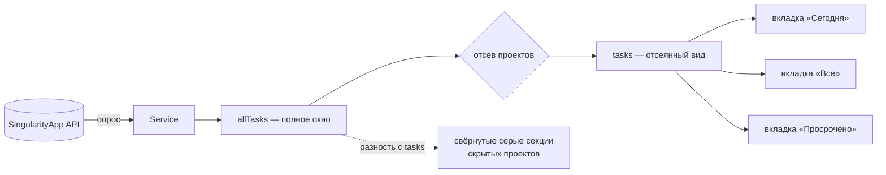

# SNG-3 Попап со списком задач - Plan

## Goal Capsule

- **Objective:** попап по клику на пилюлю, показывающий то, из чего сложилось её число: задачи окна, сгруппированные по проектам, с тремя вкладками и полным управлением с клавиатуры. Только чтение.
- **Product authority:** карточка `SNG-3` и карточка проекта `omarchy-singularity` в vault владельца, с поправкой: принятый ранее дефолт «клик по пилюле открывает оверлей» отменён решением KD2.
- **Not active scope:** мутации задач — отметка выполнения, инлайн-правка, быстрое добавление — вынесены в отдельную задачу SNG-3.1 и в этом плане не проектируются.
- **Open blockers:** нет.

## Product Contract

### Summary

Попап по клику на пилюлю показывает задачи окна «сегодня и просрочено», сгруппированные по проектам сворачиваемыми секциями. Три вкладки — разрезы одного кэша, отдельных запросов не требуют. Проекты, исключённые отсевом SNG-2, видны свёрнутой серой строкой на своём месте и разворачиваются как обычные. Открытие тянет свежие данные и показывает это.

### Problem Frame

Пилюля SNG-2 отвечает на вопрос «сколько», но не на вопрос «что именно». Число без списка заставляет открывать веб-приложение: попап убирает этот поход для вопроса «что у меня сегодня», а действия над задачами остаются в вебе до SNG-3.1.

**Текущее состояние, названное явно.** На 04.09.2026 окно задач пусто: дни рождения и профессиональные праздники уехали в Google Calendar накануне. Список исключаемых проектов тоже пуст — в записи плагина в `shell.json` ключа `excludedProjects` нет, то есть отсеянный вид сегодня тождественен полному окну. Отсюда два следствия: «всё чисто» — ожидаемое основное состояние попапа на старте, а требования про скрытые проекты (R11–R14) — задел под будущее наполнение списка, а не ответ на наблюдаемую сегодня боль.

Задел этот не праздный: отсев по названиям ломается тихо. Переименование проекта снимает исключение, опечатка не совпадает ни с чем, а до прихода кэша проектов отсев вообще не применяется — и во всех трёх случаях владелец видит просто другое число, без причины. Попап — единственное место, где причину можно показать.

### Key Decisions

- KD1. **Задача несёт только чтение; все мутации уходят в SNG-3.1.** Первые в плагине операции записи получают собственное ревью, а видимый результат приходит раньше. (session-settled: user-directed — chosen over одной задачи вместе с мутациями: карточка описывает их вместе, но запись по живым задачам — отдельный класс риска.)
- KD2. **Клик по пилюле открывает попап; оверлей вызывается хоткеем, меню и CLI.** Отменяет принятый ранее дефолт карточки проекта, отдававший клик оверлею. (session-settled: user-directed — chosen over клика по оверлею и отложенного решения: попап готов сейчас, оверлея ещё нет, и клик, не делающий ничего, — худший из вариантов.) Governs R1.
- KD3. **Три вкладки — разрезы одного кэша окна, а не разные выборки.** «Все» означает окно целиком, то есть ровно то, что считает пилюля. (session-settled: user-approved — chosen over вкладки «все незавершённые задачи аккаунта»: она потребовала бы второго кэша со своей синхронизацией.) Governs R4, R5.
- KD4. **Исключённые отсевом проекты показываются свёрнутой серой строкой на своём месте.** Отдельный переключатель и четвёртая вкладка при этом не нужны. (session-settled: user-directed — chosen over переключателя в подвале и отдельной вкладки: строка на месте убирает целое состояние.) Governs R11, R12, R13.
- KD5. **Список группируется сворачиваемыми секциями по проектам, вкладки — сегментом над списком.** (session-settled: user-directed — chosen over плоского списка с меткой проекта в строке: группировка названа в постановке задачи, метка её не заменяет.) Governs R4, R6, R7, R8.
- KD6. **Вкладки переключает горизонтальное движение, секции сворачиваются на `Enter`; `Tab` остаётся уходу на соседнюю панель.** Перехватчик клавиш оболочки не различает `h`/`l` и стрелки — они приходят одним сигналом, поэтому два смысла на горизонталь не помещаются. (session-settled: user-directed — chosen over собственного обработчика клавиш в обход штатного и over отказа от сворачивания секций: свой обработчик разошёлся бы с остальными панелями и сломался бы о поле ввода в SNG-3.1.) Governs R16, R17, R18.
- KD7. **Открытие попапа запускает опрос, и это видно.** (session-settled: user-directed — chosen over показа кэша как есть: данные могли устареть на весь интервал опроса, а молчаливое обновление выглядит как самопроизвольное шевеление списка.) Governs R20, R21.
- KD8. **Разрез по вкладке, группировка и вычисление скрытого набора живут чистыми функциями в `Api.mjs`, а не в QML.** Тот же довод, что в KTD5 плана SNG-2: тестовый раннер до QML не дотягивается, а каждый из этих шагов иногда строит новый массив — то есть способен так же тихо отменить гейт изменений. Governs R5, R6, R13.

### Requirements

**Открытие и закрытие**

- R1. Клик по пилюле открывает попап; повторный клик и `Esc` его закрывают.
- R2. Цель IPC попапа обслуживается единственным обработчиком в виджете бара, который разводит команду по экземплярам; сам попап своего обработчика не заводит. Через эту цель проходят только команды управления окном — открыть, закрыть, переключить; содержимое кэша, названия задач и проектов она не отдаёт.
- R3. Попап открывается на том экране, где стоит пилюля, — и по клику, и по команде IPC.

**Содержимое списка**

- R4. Вкладок три: «Сегодня», «Все», «Просрочено», сегментом над списком. Все три — разрезы кэша окна; переключение вкладки не порождает запроса к API.
- R5. Признак просрочки для разреза вычисляется от текущего момента тем же предикатом, что и счётчик пилюли, а не читается из признака, замороженного при разборе ответа. «Сегодня» — задачи без просрочки, «Просрочено» — с ней, «Все» — окно целиком.
- R6. Задачи сгруппированы по проектам сворачиваемыми секциями. Каждая секция имеет заголовок с названием проекта и числом задач в ней на текущей вкладке.
- R7. Свёрнутость хранится за проектом, а не за номером строки, и сохраняется при переключении вкладок в пределах одного открытия попапа — в том числе для секции, которой на соседней вкладке нет.
- R8. Задачи без проекта собраны в отдельную секцию и показываются наравне с остальными.
- R9. Строка задачи несёт название, признак просрочки по предикату из R5 и, при наличии, дедлайн отдельной меткой. Приоритет передаётся цветом и коротким текстовым обозначением, чтобы не зависеть от различения цвета.
- R10. Задача, чей проект не разрешается в название, попадает в отдельную секцию «неизвестный проект», а не сливается с секцией задач без проекта.

**Отсев и скрытые проекты**

- R11. Проект, исключённый отсевом SNG-2, показан свёрнутой строкой на своём месте в списке, визуально отличимой от обычной секции.
- R12. Скрытая секция разворачивается тем же способом, что обычная, и показывает свои задачи.
- R13. Задачи скрытых проектов не входят ни в число вкладки, ни в число пилюли; в подвале попапа отдельной строкой указано, сколько **задач** скрыто. При пустом списке исключаемых эта строка отсутствует.
- R14. Когда отсев задан, но не применён — кэш проектов ещё не пришёл, — попап говорит это прямо в подвале и не выдаёт неотсеянный список за отсеянный. Названия из списка исключаемых, не совпавшие ни с одним проектом, называются там же.

**Клавиатура**

- R15. Стрелки вверх и вниз перемещают выделение по строкам задач и заголовкам секций.
- R16. Любое горизонтальное движение — `h`, `l`, стрелки влево и вправо — переключает вкладки.
- R17. `Enter` и `Space` на выделенном заголовке сворачивают и разворачивают секцию; на строке задачи они не делают ничего.
- R18. `Tab` уводит на соседнюю панель бара, как в остальных панелях оболочки.
- R19. Всё перечисленное в R15–R18 выполняется без мыши: открыв попап, пользователь доходит до любой задачи и любой вкладки только с клавиатуры.

**Свежесть**

- R20. Открытие попапа запускает опрос сервиса, если с последней удачной синхронизации прошло больше порога свежести; иначе показывается кэш без нового запроса. До прихода ответа в обоих случаях виден текущий кэш.
- R21. В подвале попапа видно, что обновление идёт, и когда была последняя удачная синхронизация.
- R22. Выделение держится за задачей, а не за номером строки. Если задача-якорь ушла из окна, выделение переходит на следующую задачу той же секции, при её отсутствии — на предыдущую, а при опустевшей секции — на её заголовок.

**Состояния**

- R23. Три нерабочих состояния сервиса — нет токена, ошибка запроса, загрузка при пустом кэше — показаны в попапе и различимы. Причина показывается нашей собственной формулировкой по классу ошибки; текст исключения, тело ответа API и вывод `stderr` не попадают в интерфейс ни целиком, ни фрагментом.
- R24. Пустое окно показывается как «всё чисто», а не как пустой попап без объяснения.
- R25. Вкладка, чей разрез пуст при непустом окне, говорит это своей формулировкой, отличной от «всё чисто».
- R26. Окно, целиком ушедшее под отсев, говорит это своей формулировкой: «всё чисто» и «скрыто N» вместе не показываются.

**Оформление**

- R27. Цвета, отступы и размеры берутся только из `Commons/Color.qml` и `Commons/Style.qml`; при смене темы попап не выбивается из оболочки.
- R28. Все строки, пришедшие из API — названия задач и проектов, — выводятся как простой текст; разметка и ссылки в них не интерпретируются.

### Откуда попап берёт данные

Разрезы вкладок и скрытые секции читаются из разных свойств сервиса, и это единственное неочевидное место в потоке данных.

Числа вкладок и секций считаются от отсеянного вида; строка «скрыто N» — от разности с полным окном, то есть по задачам. Готовое свойство сервиса `excludedCount` для этого не годится: оно считает названия в настройке, а не скрытые задачи.

### Key Flows

- F1. Открытие попапа
  - **Trigger:** клик по пилюле или команда её цели IPC.
  - **Steps:** попап открывается на текущем кэше; при истёкшем пороге свежести сервис получает запрос на опрос; подвал показывает, что обновление идёт; по приходу ответа список и числа обновляются, выделение остаётся на прежней задаче.
  - **Outcome:** пользователь видит список сразу и получает свежий в пределах одного запроса.
  - **Covers R1, R20, R21, R22.**
- F2. Просмотр скрытого проекта
  - **Trigger:** выделение серой строки скрытого проекта и разворот.
  - **Steps:** секция раскрывается и показывает задачи исключённого проекта; числа вкладки и пилюли при этом не меняются.
  - **Outcome:** видно, что именно скрыл отсев, без правки настройки.
  - **Covers R11, R12, R13.**
- F3. Переход между вкладками с клавиатуры
  - **Trigger:** горизонтальное движение при открытом попапе.
  - **Steps:** активная вкладка меняется, список перестраивается из того же кэша, свёрнутость секций сохраняется.
  - **Outcome:** ни одного запроса к API, состояние секций не теряется.
  - **Covers R4, R7, R16.**

### Acceptance Examples

- AE1. **Covers R5.** Given в окне две задачи, одна просрочена, when открыта вкладка «Просрочено», then показана одна задача; на вкладке «Все» — обе.
- AE2. **Covers R5.** Given задача со стартом сегодня и попап, открытый до полуночи и оставшийся открытым после, when вкладка «Просрочено» перерисована, then задача в ней есть, и её число совпадает с числом пилюли.
- AE3. **Covers R13.** Given проект «Дни рождения» внесён в список исключаемых и содержит три задачи окна, when попап открыт, then числа вкладок эти три задачи не учитывают, а в подвале указано «скрыто 3».
- AE4. **Covers R11, R12, R13.** Given тот же случай, when серая строка «Дни рождения» развёрнута, then три задачи видны, а числа вкладок и пилюли не изменились.
- AE5. **Covers R13.** Given список исключаемых пуст, when попап открыт, then строки «скрыто N» в подвале нет.
- AE6. **Covers R14.** Given список исключаемых задан, а кэш проектов ещё не пришёл, when попап открыт, then в подвале сказано, что отсев не применён, и полный список не выдаётся за отсеянный.
- AE7. **Covers R26.** Given все задачи окна принадлежат исключённым проектам, when попап открыт, then он не показывает «всё чисто», а говорит, что всё скрыто отсевом, и называет число скрытых.
- AE8. **Covers R7.** Given секция «Дача» свёрнута на вкладке «Все», when пользователь перешёл на «Сегодня», где у неё нет задач, и вернулся обратно, then секция по-прежнему свёрнута.
- AE9. **Covers R22.** Given выделение стоит на второй задаче списка, when пришедший ответ добавил задачу выше неё, then выделение осталось на той же задаче, а не на её соседе.
- AE10. **Covers R22.** Given выделение стоит на задаче, when пришедший ответ убрал её из окна, then выделение перешло на следующую задачу той же секции, а при её отсутствии — на заголовок секции.
- AE11. **Covers R23.** Given файла с токеном нет, when попап открыт, then он показывает состояние «нет токена» с указанием, куда положить токен, и не показывает пустой список.
- AE12. **Covers R24.** Given окно пусто, токен на месте и список исключаемых пуст, when попап открыт, then он показывает «всё чисто».

### Scope Boundaries

- Любые изменения задач: отметка выполнения и её снятие, инлайн-правка названия, быстрое добавление. Уходят в SNG-3.1.
- Правка дедлайна, приоритета и переноса задачи между проектами. Не входит и в SNG-3.1 без отдельного решения.
- Оверлей — SNG-4. Попап не пытается его заменить и не открывается его каналом.
- Вызов оверлея хоткеем, пунктом меню и командой CLI, названный в KD2, — SNG-6.
- Вкладка «все незавершённые задачи аккаунта» и второй кэш под неё.
- Настройка состава вкладок и порядка секций. Порядок фиксирован.
- Ввод токена через интерфейс. Токен по-прежнему кладётся в файл руками.

### Dependencies / Assumptions

Проверено чтением исходников оболочки и нашего кода 04.09.2026, в том числе независимым ревью в семь линз.

- **Базовый тип виджета не меняется.** Своя цель IPC не требует перехода на `Ui/Panel`: бар опознаёт панель по наличию `open`, `close` и `opened`, а `IpcHandler` объявляется в любом элементе. Пилюля остаётся на `Ui/BarWidget` и сохраняет `vertical`, `barSize` и `broadcast()`; попап — вложенная панель, как в штатных `plugins/panels/clock` и `plugins/panels/weather`.
- **`broadcast()` не роскошь, а условие R3.** Панель бара живёт по экземпляру на монитор, а фиксированная цель IPC маршрутизируется ровно в один из них — оболочка сама называет это причиной, по которой панельные хоткеи не ходят через цель напрямую. Штатные панели ставят `manageIpc: false` и держат единственный обработчик в виджете бара.
- **`switchPanelFrom` опознаёт панель по виджету бара в слоте**, а не по вложенной панели. Для R18 попапу нужны ссылка на виджет-хозяин и переопределённый переход, как в `plugins/panels/clock`; иначе `Tab` молча не сработает и ошибки не покажет.
- **Перехватчик клавиш не различает `h`/`l` и стрелки** — обе пары приходят одним сигналом горизонтального движения. Это и есть причина KD6. `Enter` при этом поднимает два сигнала подряд, возврата и активации; обработчик, принимающий оба за активацию, сработает дважды — гасится так же, как в плагине todoist.
- **Компонента вкладок в `Ui/` нет** ни у одного плагина оболочки; ближайшее готовое — `Ui/ButtonGroup`, одна точка табуляции на группу, а не одна на сегмент.
- **Кэш проектов пополняется только хвостом полной выборки.** Инкрементальный опрос его не трогает, поэтому проект, созданный после последней полной выборки, придёт задачами без разрешимого названия — отсюда R10.
- **Обычный вызов обновления у сервиса инкрементальный**, полную выборку форсирует только вызов через IPC. Для R20 инкремента достаточно.
- **Сервис уже публикует полное окно отдельным свойством**, доступным другому компоненту; менять его контракт для этой задачи не требуется.
- **Признак просрочки в кэше заморожен при разборе ответа**, а счётчик пилюли пересчитывает его от текущего момента. Отсюда R5: разрез обязан считаться так же, иначе после полуночи вкладка и пилюля разойдутся.

### Outstanding Questions

**Deferred to Planning**

- Каким компонентом собирать вкладки: `Ui/ButtonGroup` с отключённой табуляцией или собственный ряд кнопок.
- Способ хранения свёрнутости секций за проектом в пределах открытия попапа (R7).
- Как именно держать выделение за задачей при перестроении списка (R22).
- Порядок секций в списке — по порядку от сервиса, по алфавиту или иначе; и где в этом порядке стоят скрытые секции.
- Величина порога свежести в R20 относительно штатного интервала опроса.
- Где оседает диагностическая часть ошибки, раз на экран по R23 уходит только наша формулировка.

### How This Work Fits Together

<!-- ce-section: work-relationships -->

Этот план владеет попапом, показывающим содержимое окна. Разбивка отражает текущее понимание порядка сборки, а не обязательство.

- SNG-3.1 мутации из попапа. Depends on этот план: отметка выполнения, инлайн-правка названия, быстрое добавление; Still to decide — оптимистичное обновление с откатом или ожидание ответа, и как поле ввода поделит `Enter` с перехватчиком клавиш, у которого для этого есть штатное свойство блокировки.
- SNG-4 оверлей. Shares с этим планом отсев проектов и кэш окна; Can proceed independently of попапа, потому что вызывается своим каналом. Still to decide — переиспользует ли оверлей список и группировку попапа или строит свои, и постоянный дом списка исключаемых, унаследованный вопрос из плана SNG-2 (`docs/plans/2026-09-03-002-feat-sng-2-pilyulya-plan.md`).
- SNG-5 привычки и время. Can proceed independently of этого плана.
- SNG-6 CLI и хоткей. Depends on SNG-4; заодно закрывает вызов оверлея хоткеем, названный в KD2.

### Sources / Research

- Оболочка: `Ui/Panel.qml`, `Ui/BarWidget.qml`, `Ui/PanelKeyCatcher.qml`, `Ui/ButtonGroup.qml`, `shell.qml` (маршрутизация вызова и оговорка про фиксированную цель IPC), `plugins/bar/Bar.qml` (опознание панели по слоту, переход на соседнюю), `plugins/panels/clock` (единственный обработчик IPC в виджете бара, ссылка на виджет-хозяин).
- Образцы попапов на машине: `io.github.aryan-techie.todoist` — единственный, где уже сделаны группировка, курсор, вкладки и запись, и где гасится сдвоенный `Enter`; `mozzy.kaj` — сервис плюс тонкий виджет плюс панель; `ir.git-sync` — та же схема в 340 строках.
- Наш код: `Service.qml` (окно, отсев, публикуемые свойства, признак применённости отсева), `BarWidget.qml` (пилюля SNG-2, её опора на `vertical`, формулировки состояний), `Api.mjs` (`isCurrent`, замороженный признак просрочки, пересчёт в `countWindow`), `docs/solutions/logic-errors/quiet-gate-identity-check-outside-pure-function.md` — основание KD8.
- Ревью требований 04.09.2026, семь линз: связность, реализуемость, продуктовая, дизайн, безопасность, страж скоупа, состязательная. Тридцать шесть находок. Поймано в том числе: невыполнимость первой редакции клавиатурной модели, неверное утверждение о цене собственной цели IPC, расхождение разреза вкладок с пилюлёй после полуночи и отсутствие состояния «отсев не применён».
