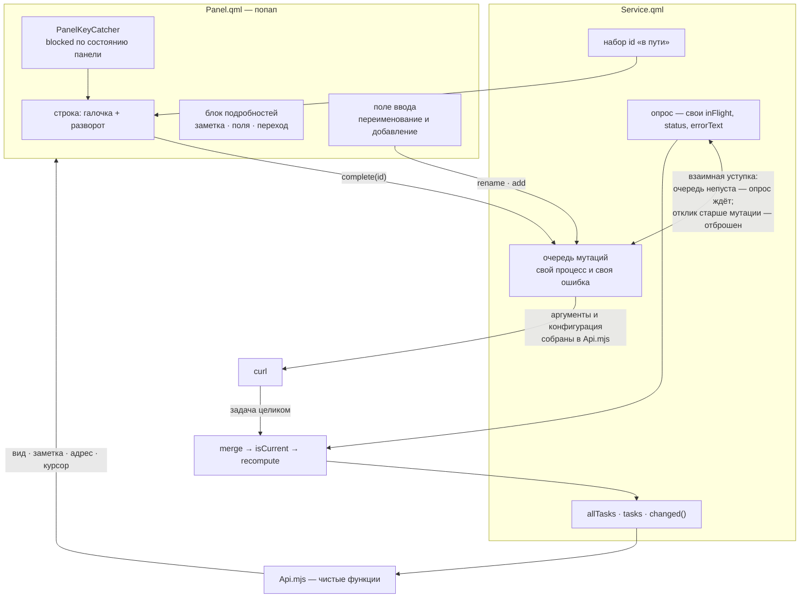

# SNG-3.1 Действия над строкой задачи - Plan

## Goal Capsule

- **Objective:** строка задачи в попапе получает действия — отметку выполнения, разворот подробностей с заметкой, переход в веб-версию и переименование на месте, — плюс быстрое добавление задачи во Входящие.
- **Product authority:** карточка `SNG-3.1` в vault владельца, уточнённая брейнштормом 04.09: владелец назвал четыре желаемых действия и выбрал держать их одной задачей.
- **Not active scope:** кнопка открытия оверлея. Оверлей не существует — `Overlay.qml` это заглушка на 19 строк с нулевым размером, отвечающая контракту `open`/`close`/`toggle` и ничего не рисующая. Кнопка появится в SNG-4 вместе с тем, что она открывает.
- **Open blockers:** нет.
- **Product Contract preservation:** changed — R3 уточнено (задача не только уходит по ответу, но и не возвращается фоновым опросом), R4 уточнено (неудача записи не переводит попап в состояние сломанного опроса), добавлено R21 о секретности пути записи. Все три пришли из ревью плана и делают явными свойства, которые скоуп подразумевал; идентификаторы прежних требований не менялись.

## Product Contract

### Summary

Попап умеет только читать. Здесь строка задачи получает галочку и разворот: галочка отмечает выполнение, разворот показывает заметку задачи и заполненные поля, оттуда же открывается веб-версия и правится название. Внизу списка появляется поле быстрого добавления.

### Problem Frame

Увидев в попапе задачу, с ней ничего нельзя сделать — любое действие означает поход в веб-приложение. При этом две трети задач несут заметку, которую попап не показывает вовсе: чтобы прочитать «оцинкованные, 4×40», надо открыть браузер.

**Что известно про данные.** У 27 задач из 40 заполнена заметка; медиана — 227 символов, максимум 681. Из 39 полей задачи заполнено 10, и 29 пусты у всех задач выборки. Повторяющихся задач в аккаунте сейчас ноль, два дня назад было двенадцать — они ушли вместе с днями рождения в Google Calendar.

**Что известно про API.** Операции записи возвращают саму задачу целиком, а не пустой ответ. Обращение занимает 517–588 мс по шести замерам; полный опрос списка для сравнения — около 690 мс.

### Key Decisions

- KD1. **Пять действий идут одной задачей и одним MR; шестое — кнопка оверлея — выведено из скоупа отдельно.** (session-settled: user-directed — chosen over разделения на чтение и запись двумя карточками: владелец выбрал не дробить, приняв, что поле ввода и первые мутации попадут в одно ревью.) Governs R1, R6, R9, R12, R15.
- KD2. **Галочка стоит на каждой строке, остальные действия живут в развороте.** Отметка — самое частое действие и единственное, что стоит держать под мышью; прочее не утяжеляет список. (session-settled: user-directed — chosen over «всё на строке» и «всё в развороте»: первое делает строку плотной и в вертикальном баре сталкивает метки с действиями, второе превращает отметку в два нажатия и лишает её мыши.) Governs R2, R6, R9.
- KD3. **Отметка честно показывает «отправлено» и ждёт ответа сервера.** Кэш не меняется до подтверждения, поэтому и откатывать нечего. (session-settled: user-directed — chosen over оптимистичного обновления с откатом и over отсутствия отклика вовсе: первое утверждает то, чего сервер не подтвердил, второе оставляет полсекунды тишины после клика.) Governs R3, R4.
- KD4. **Быстрое добавление кладёт задачу во Входящие.** «Входящие» в SingularityApp — это отсутствие проекта, а не проект: среди 33 проектов такого нет, а задача без `projectId` в приложении попадает именно туда. (session-settled: user-directed — chosen over проекта текущей секции и настраиваемого проекта по умолчанию.) Governs R12, R13.
- KD5. **Разворот показывает заметку и заполненные поля, а не все поля подряд.** Буквальные «все поля» дали бы экран пустых строк: 29 из 39 пусты у всех задач. Governs R7, R8.
- KD6. **Повторяющаяся задача из попапа не отмечается.** Чем `complete` отличается от `complete-today`, спецификация не говорит — описания у обеих операций пустые, — а проверить опытом нельзя: `TaskCreateDto` не принимает `recurrence`, повторяющуюся задачу через API не создать. Ошибка здесь гасит серию. Governs R5.
- KD7. **Оба резидуала SNG-3 закрываются до первой операции записи.** Сегодня они безобидны потому, что `Enter` лишь сворачивает секцию; действие над задачей делает их разрушительными. Governs R17, R18.

### Requirements

**Отметка выполнения**

- R1. Галочка видна на каждой строке задачи и нажимается мышью и с клавиатуры.
- R2. Нажатие галочки немедленно меняет её вид на «в пути»; строка остаётся в списке, числа вкладки и пилюли не меняются.
- R3. Задача уходит из окна и числа пересчитываются только после ответа сервера, из данных этого ответа, и фоновый опрос её не возвращает.
- R4. Неудачная запись возвращает интерфейс в исходный вид и называет причину нашей формулировкой по классу ошибки, не переводя попап в состояние сломанного опроса.
- R5. Повторяющаяся задача не отмечается из попапа: вместо действия предлагается открыть её в веб-версии, с указанием причины.

**Разворот подробностей**

- R6. Строка задачи разворачивается и сворачивается по нажатию; развёрнутой может быть одна строка за раз.
- R7. Разворот показывает заметку задачи простым текстом.
- R8. Разворот показывает поля задачи, у которых есть значение, и не показывает пустые.
- R9. Из развёрнутого блока доступны переход в веб-версию и переименование.
- R10. Строки, пришедшие из API, выводятся простым текстом; разметка в них не интерпретируется.

**Переход в веб-версию**

- R11. Действие открывает задачу в веб-версии SingularityApp в браузере по умолчанию.

**Быстрое добавление**

- R12. Поле быстрого добавления находится внизу списка и создаёт задачу во Входящие — без проекта.
- R13. Созданная задача имеет `start` на сегодня и появляется в списке попапа после ответа сервера.
- R14. Пустая строка задачу не создаёт.

**Переименование**

- R15. Переименование правит название на месте, в строке задачи.
- R16. `Esc` отменяет правку и возвращает прежнее название; подтверждение сохраняет его через API.

**Клавиатура и целостность**

- R17. Ни одно действие не выполняется по устаревшей ссылке на строку или секцию.
- R18. Курсор, потерявший свою задачу, не оказывается на строке чужого проекта.
- R19. Все действия выполняются с клавиатуры без мыши.
- R20. Поле ввода, получив фокус, забирает клавиши себе: навигация по списку в это время не срабатывает.
- R21. Ни токен, ни набранный пользователем текст не попадают в аргументы запускаемых процессов и в строку конфигурации в виде, способном её изменить.
- R22. Мутация, не дошедшая до ответа, не оставляет галочку отмеченной «в пути» навсегда и не останавливает очередь.

### Key Flows

- F1. Отметить задачу выполненной
  - **Trigger:** галочка на строке под курсором.
  - **Steps:** галочка меняет вид на «в пути», строка остаётся на месте; уходит запрос; по ответу задача исчезает из окна, числа вкладки и пилюли пересчитываются.
  - **Outcome:** список показывает подтверждённое сервером состояние и ни в один момент не показывает неподтверждённого.
  - **Covers R1, R2, R3.**
- F2. Прочитать подробности и уйти в веб
  - **Trigger:** нажатие на строку задачи.
  - **Steps:** строка разворачивается, показывает заметку и заполненные поля; из блока открывается веб-версия задачи.
  - **Outcome:** содержимое заметки прочитано без браузера, а если нужно больше — переход одним действием.
  - **Covers R6, R7, R8, R9, R11.**
- F3. Добавить задачу, не покидая попапа
  - **Trigger:** поле быстрого добавления.
  - **Steps:** введённое название создаёт задачу во Входящие со стартом сегодня; после ответа сервера она появляется в списке.
  - **Outcome:** мысль записана туда же, куда её кладёт приложение, без переключения окна.
  - **Covers R12, R13, R14, R20.**

### Acceptance Examples

- AE1. **Covers R2, R3.** Given задача в окне, when нажата её галочка, then галочка сразу меняет вид, а число вкладки остаётся прежним до ответа сервера.
- AE2. **Covers R3.** Given отметка подтверждена сервером, when ответ пришёл, then задача исчезла из списка и число пилюли уменьшилось на единицу, без второго запроса к API.
- AE3. **Covers R4.** Given сеть недоступна, when нажата галочка, then галочка вернулась в исходный вид, задача осталась в списке, и названа причина нашей формулировкой.
- AE4. **Covers R5.** Given повторяющаяся задача, when пользователь пытается её отметить, then отметка не отправляется и предложено открыть задачу в веб-версии.
- AE5. **Covers R7.** Given задача с заметкой, when строка развёрнута, then текст заметки читается целиком и без разметки.
- AE6. **Covers R8.** Given задача без дедлайна, when строка развёрнута, then строки «дедлайн» в блоке нет.
- AE7. **Covers R6.** Given одна строка уже развёрнута, when развёрнута другая, then первая свернулась.
- AE8. **Covers R12, R13.** Given введено название в поле добавления, when оно подтверждено, then в веб-приложении появилась задача во Входящих со стартом на сегодня.
- AE9. **Covers R16.** Given начатое переименование, when нажат `Esc`, then название вернулось к прежнему и в API ничего не ушло.
- AE10. **Covers R20.** Given фокус в поле ввода, when нажаты стрелки вверх и вниз, then курсор по списку не двигается, а каретка ходит по тексту.
- AE11. **Covers R19.** Given попап открыт, when пользователь не касается мыши, then он может отметить задачу, развернуть её, открыть в вебе, переименовать и добавить новую.
- AE12. **Covers R10.** Given заметка содержит текст, похожий на разметку, when строка развёрнута, then он показан как есть.
- AE13. **Covers R15.** Given начатое переименование, when введено новое название и подтверждено, then оно заменило прежнее в списке и сохранилось в веб-приложении.
- AE14. **Covers R17.** Given пришедший ответ перестроил список под курсором, when пользователь тут же отмечает задачу, then отмечена та задача, которая подсвечена, а не та, что стояла на этом месте до перестроения.
- AE15. **Covers R18.** Given секция опустела после отметки последней её задачи, when список перестроился, then курсор не оказался на заголовке чужого проекта.

### Scope Boundaries

- Кнопка открытия оверлея. Оверлей — заглушка, открывать нечем; кнопка приезжает с SNG-4.
- Удаление задачи, смена дедлайна, приоритета и проекта.
- Отмена выполненного действия.
- Правка заметки. Заметка только читается.
- Показ форматирования заметки — списков, жирного, ссылок. Текст выводится плоским.
- Настройка состава полей в развороте.

### Dependencies / Assumptions

- SNG-3 влита: попап, вкладки, секции, клавиатура и состояния работают.
- Операции записи возвращают задачу целиком, поэтому кэш обновляется откликом мутации без второго запроса. Проверено на живом API.
- Заметка приходит размеченной; плоский текст достаётся склейкой текстовых вставок. Формат проверен на живых данных.
- Поля `note` и `recurrence` сейчас не запрашиваются и должны попасть в выборку. Это увеличит объём ответа опроса.
- Перехватчик клавиш оболочки умеет стоять в стороне, пока поле ввода в фокусе; приём применён двумя соседними плагинами.

### Outstanding Questions

**Deferred to Planning**

- Вид ссылки на задачу в веб-версии. Веб-приложение маршрутизирует по хешу; точный адрес задачи не установлен, сборка не отдалась за отведённое время. Если адреса задачи нет, действие открывает её проект.
- Как именно галочка показывает «в пути» и как обозначается повторяющаяся задача, которую отметить нельзя.
- Порядок и подписи полей в развороте.
- Клавиши для действий. Свободны `Enter` на строке задачи, а также буквенные клавиши; `Enter` и `Space` различимы существующим флагом, потому что перехватчик поднимает возврат только на `Enter`.
- Переименование секции «Без проекта» во «Входящие» — то же множество задач под именем из приложения.

**Resolve Before Planning**

- Нет.

### How This Work Fits Together

<!-- ce-section: work-relationships -->

Задача продолжает SNG-3 и опирается на её попап целиком. Кнопка оверлея, названная владельцем в числе желаемого, вынесена из скоупа до SNG-4 — она единственная из четырёх названных, которой нечего открывать.

Пункт «со звёздочкой» карточки — оптимистичное обновление с откатом — снимается решением KD3. Его **забота** закрыта другим механизмом: отклик на нажатие приходит немедленно, поэтому «попап залипает» не наступает. Его **механизм** не реализуется: владелец выбрал, чтобы числа ждали подтверждения сервера. Это закрытие по покрытию заботы, а не доказательство невозможности — при существенно большей задержке, чем измеренные 550 мс, размен стоит пересмотреть, и тогда пункт вернётся своей карточкой.

Инлайн-правка и быстрое добавление остались в скоупе, хотя владелец не назвал их в числе желаемого: решение KD1 держать всё одной задачей сохраняет их из исходных критериев карточки.

### Sources / Research

- Карточка `SNG-3.1` в vault владельца.
- `docs/residual-review-findings/feat-sng-3-popap.md`, пункты 4 и 5 — резидуалы, которые эта задача обязана закрыть.
- `docs/solutions/design-patterns/incremental-sync-window-filter-on-client.md` — почему инкремент не видит выхода задачи из окна и почему отклик мутации это обходит.
- `docs/solutions/logic-errors/quiet-gate-field-list-comparison-omits-title.md` — состав сравнения в тихом гейте обязан покрывать всё, что рисует потребитель; новые поля в развороте это затрагивают.
- Спецификация API: <https://api.singularity-app.com/v2/api-json>.
- Замеры и разведка по живым данным аккаунта, 04.09.2026.

---

## Planning Contract

### Key Technical Decisions

- KTD1. **Строка конфигурации curl собирается чистой функцией с экранированием.** Конфигурация принимает `request`, `header` и `data` — проверено запросом, — но значение в ней заключено в кавычки, и кавычка внутри значения обрывает его, а перевод строки добавляет в конфигурацию собственную директиву. Это тот же канал `-K -`, которым едет токен: `applySettings` уже отвергает токен по `/[\r\n"]/` с комментарием про инъекцию. Для набранного пользователем названия «отвергнуть» не годится — его надо экранировать. Сборка живёт в `Api.mjs`, потому что ошибка здесь молчалива: запрос уходит с обрезанным телом и создаёт задачу не с тем названием. Governs R12, R15, R21.
- KTD2. **Массив аргументов процесса тоже собирается чистой функцией.** Свойство «ни токена, ни текста задачи в `argv`» — главное защитное свойство этого юнита, и проверять его глазами в процессе, который живёт полсекунды, значит не проверять вовсе. Собранный в `Api.mjs`, он пиннится тестом и переживает следующую правку. Governs R21.
- KTD3. **Мутации идут очередью через один процесс, и любое завершение снимает идентификатор.** Два быстрых нажатия не должны драться за `Process`; но важнее третий путь: ранний возврат при опустевшем токене и исчерпание времени ожидания тоже обязаны снять идентификатор и взять следующую из очереди, иначе галочка застревает «в пути» навсегда, а очередь останавливается молча. Повторная постановка идентификатора, уже стоящего в наборе, мутации не создаёт. Governs R2, R22.
- KTD4. **Опрос и мутация не наступают друг другу на пятки.** `merge` побеждает по правилу «последний пришедший» без сравнения времени изменения, а полная выборка заменяет кэш целиком. Опрос длится около 690 мс, мутация — около 550: опрос, начатый до нажатия и пришедший после отклика, вернул бы отмеченную задачу в список с обычной галочкой, и числа отыграли бы назад. Поэтому при непустой очереди мутаций опрос откладывается, а отклик опроса, начатого раньше последней завершённой мутации, отбрасывается с немедленным повтором. Governs R3.
- KTD5. **Отклик мутации сливается существующим `merge` без новой логики фильтрации.** `isCurrent` первой строкой отвергает задачу с `checked !== 0`, поэтому завершённая выпадает из окна сама. Проверено по коду. Governs R3.
- KTD6. **У записи своя поверхность отказа, отдельная от опроса.** `finishWithError` владеет состоянием опроса — `status`, `inFlight`, `refreshPending` — и вызов его из пути записи перекрасил бы весь попап в состояние сломанного сервиса из-за одной не сохранившейся галочки, а `drainPending` мог бы запустить второй опрос. Текст ошибки записи живёт своим свойством и показывается той же классификацией. Governs R4.
- KTD7. **Признак «в пути» живёт набором идентификаторов в сервисе, а не полем внутри задачи.** Поле внутри задачи попало бы в кэш и в сравнение тихого гейта, где ему не место: это состояние интерфейса, а не данные. Governs R2, R4.
- KTD8. **Заметка, поля, адрес в вебе и признак повтора — чистые функции в `Api.mjs`.** Каждая из них решает молчаливо: неразобранная заметка выглядит как её отсутствие, неверно собранный адрес открывает правдоподобную не ту страницу, невзведённый признак повтора гасит серию. Граница задана `AGENTS.md`. Governs R5, R7, R8, R11.
- KTD9. **Неразобранная непустая заметка возвращается как есть с признаком «не разобрано».** Отдавать пустой текст значит выбрать молчаливую ошибку поведением по умолчанию: пользователь увидит пустой блок и решит, что заметки нет. Governs R7.
- KTD10. **Оба резидуала закрываются первым юнитом, до появления любой операции записи.** `sameFlat` начинает сравнивать объект секции по ссылке — не её ключ: у строки-заголовка ключ уже вшит в идентификатор, и сравнение ключа не изменило бы ничего. `cursorIndexForId` при отсутствии уцелевшей строки своей секции снимает курсор, а не клампит на чужую. Инстанцирует KD7. Governs R17, R18.
- KTD11. **Клавиши: `Space` отмечает, `Enter` разворачивает, `o` открывает в вебе, `e` переименовывает, `n` добавляет.** Перехватчик поднимает возврат только на `Enter`, поэтому существующий флаг уже различает `Enter` и `Space`. Проверено по коду перехватчика. Governs R1, R6, R19.
- KTD12. **Поле ввода поднимает `blocked` через свойство панели, а не по ссылке на себя, и само обрабатывает `Esc`.** Поле переименования живёт внутри строки, на два повторителя вглубь, — сослаться на него из панели нечем, поэтому панель держит идентификатор переименовываемой задачи. `Ui/TextField` обработки `Esc` не несёт вовсе: при поднятом `blocked` перехватчик клавиши только пропускает, и без собственного обработчика пользователь остался бы заперт в поле. Governs R16, R20.
- KTD13. **`note` и `recurrence` добавляются и в запрашиваемые поля, и в `normalizeTask`.** Нормализация собирает задачу поимённо из двенадцати ключей и молча отбрасывает остальное — поле, добавленное только в список запрашиваемых, придёт и пропадёт. Последствие несимметрично: пустой блок заметок заметят сразу, невзведённый признак повтора не заметит никто. Governs R5, R7.
- KTD14. **Вид поля повтора снимается с живой задачи до написания предиката.** Через API повторяющуюся задачу не создать, но в веб-приложении — можно; предикат по угаданной форме отказывает молча и в опасную сторону. Governs R5.

### High-Level Technical Design

Опрос и запись делят кэш, но не состояние: у каждого свой процесс, свой признак занятости и свой текст ошибки. Единственное место их встречи — `merge`, и порядок прихода там разрешается явно, а не случайно.

---

## Implementation Units

### U1. Закрыть оба резидуала SNG-3

- **Goal:** ни одно будущее действие не пойдёт по устаревшей ссылке и не попадёт на строку чужого проекта.
- **Requirements:** R17, R18; KD7, KTD10.
- **Dependencies:** нет.
- **Files:** `Api.mjs` (изменить), `test/api.test.mjs` (изменить).
- **Approach:**
  1. `sameFlat` сравнивает у строки объект `group` **по ссылке**, а не её ключ. Ключ у строки-заголовка уже вшит в идентификатор, поэтому сравнение ключа не изменило бы ничего, а резидуал назван по имени поля.
  2. `cursorIndexForId`, не найдя ни одной уцелевшей строки своей секции, возвращает `-1` вместо клампа на произвольную строку — заголовок чужого проекта и его задача одинаково неверны.
- **Patterns to follow:** `sameGroups` и `sameOrder` в `Api.mjs` — сравнение по элементам с возвратом прежней ссылки.
- **Execution note:** сначала тест, воспроизводящий промах, потом правка — оба дефекта сегодня невидимы. Существующее утверждение «исчезнувшая секция — откат на индекс» в `test/api.test.mjs` **переписывается**: оно закрепляет ровно то поведение, которое R18 запрещает.
- **Test scenarios:**
  - Covers R17. Перестроение, меняющее у секции только `hidden` или `title` при тех же `key`, идентификаторе строки и задаче, возвращает новый плоский список.
  - Covers R18. Исчезновение целой секции возвращает `-1`, а не строку другого проекта — ни заголовок, ни задачу.
  - Covers R18. Уцелевшая строка своей секции по-прежнему находится: прежнее поведение восстановления по идентификатору и отката внутри секции не тронуто.
- **Verification:** `TZ=Asia/Omsk node --test test/api.test.mjs` зелёный; число тестов выросло с 65, одно прежнее утверждение переписано.

### U2. Чистые функции подробностей и разведка повтора

- **Goal:** содержимое развёрнутого блока и признак повтора определяются в модуле, куда дотягивается тестовый раннер, и по наблюдённым данным.
- **Requirements:** R5, R7, R8, R10, R11; KTD8, KTD9, KTD14.
- **Dependencies:** нет.
- **Files:** `Api.mjs` (изменить), `test/api.test.mjs` (изменить).
- **Approach:**
  1. **Разведка первой:** повторяющаяся задача заводится вручную в веб-приложении (API её не создаёт, интерфейс — да), снимается фактический вид поля повтора в ответе, и предикат пишется против снятого значения. Задача удаляется после снятия.
  2. Разбор заметки: значение приходит строкой с массивом операций, склеиваются текстовые вставки. Возвращается объект с текстом и признаком разбора: пустое или отсутствующее значение даёт пустой текст с признаком «нечего разбирать», непустое неразобранное — исходную строку с признаком «не разобрано».
  3. Отбор полей для показа: пары «подпись — значение» только для заполненных, в фиксированном порядке.
  4. Адрес задачи в веб-версии: чистая функция от постоянной базы и процент-кодированного идентификатора; при неизвестном виде адреса задачи возвращается адрес её проекта с признаком, по которому вызывающий отличит один исход от другого. Наружу уходит только схема `https`.
  5. Предикат повторяющейся задачи. **Отсутствие поля в ответе трактуется как «не знаю»**, и отметка не отправляется ни для одной задачи: неверная форма поля обязана падать громко, а не гасить серии молча.
- **Patterns to follow:** `errorClass` и `emptyReason` в `Api.mjs` — чистая функция с разбором по случаям и тестом на каждый.
- **Test scenarios:**
  - Covers R7. Заметка из одной вставки даёт её текст; из нескольких — склейку.
  - Covers R7. Пустая и отсутствующая заметка дают пустой текст с признаком «нечего разбирать».
  - Covers R7. Непустая неразбираемая заметка возвращает исходную строку с признаком «не разобрано», а не пустой текст.
  - Covers R8. Задача без дедлайна не даёт пары «дедлайн»; порядок пар одинаков при одинаковом наборе заполненных полей.
  - Covers R11. Задача с известным видом адреса даёт адрес задачи; без него — адрес проекта, и признак это различает.
  - Covers R11. Идентификатор со спецсимволами кодируется; функция не возвращает адреса иной схемы.
  - Covers R5. Задача со снятым в разведке видом поля распознаётся как повторяющаяся.
  - Covers R5. Ответ **без** поля повтора даёт «не знаю», а не «обычная задача».
  - Повторный вызов на неизменном входе возвращает прежнюю ссылку.
- **Verification:** тесты зелёные; вид поля повтора записан в план по факту, а не по догадке.

### U3. Поверхность записи в сервисе

- **Goal:** сервис выполняет мутацию, кладёт отклик в кэш и сообщает о неудаче, не задевая опрос.
- **Requirements:** R2, R3, R4, R12, R13, R14, R15, R16, R21, R22; KTD1, KTD2, KTD3, KTD4, KTD5, KTD6, KTD7, KTD13.
- **Dependencies:** **U1**, U2.
- **Files:** `Service.qml` (изменить), `Api.mjs` (изменить), `test/api.test.mjs` (изменить).
- **Approach:**
  1. Сборка **массива аргументов** и **строки конфигурации** уезжает в `Api.mjs`. Конфигурация заключает значение в кавычки, экранирует обратную косую и кавычку, и отвергает значение с возвратом каретки или переводом строки — тем же правилом, каким `applySettings` отвергает такой токен. В `Service.qml` остаётся присваивание.
  2. Тело запроса собирается чистой функцией — для создания задачи и для правки названия.
  3. Один `Process` под мутации и очередь. **Любое** завершение — успех, ненулевой код, ранний возврат при опустевшем токене, исчерпание времени — снимает идентификатор из набора «в пути» и берёт следующую. Идентификатор, уже стоящий в наборе, повторно не ставится.
  4. При опустевшем токене очередь очищается, набор «в пути» сбрасывается, пришедший отклик игнорируется — тем же условием, что уже стоит в обработчике опроса.
  5. Успешный отклик разбирается новой точкой входа для одной задачи (существующий разбор ждёт массив) и уходит в `merge` поверх текущего кэша.
  6. **Координация с опросом:** при непустой очереди мутаций опрос откладывается через существующий признак отложенного опроса; отклик опроса, начатого раньше завершения последней мутации, отбрасывается с немедленным повтором.
  7. Неудача не трогает кэш и **не вызывает** `finishWithError`: текст ошибки записи живёт своим свойством, `status`, `inFlight` и признак отложенного опроса остаются за опросом. Очередь после неудачи продолжается, а не обрывается.
  8. `note` и `recurrence` добавляются **и** в запрашиваемые поля, **и** в `normalizeTask`.
- **Patterns to follow:** `runAuthedCurl`, `inFlight`/`refreshPending` и обработчик `onExited` в `Service.qml`; очередь действий в `io.github.aryan-techie.todoist/Panel.qml`. `finishWithError` — **не** образец для пути записи.
- **Execution note:** тело, конфигурация и массив аргументов покрываются тестами до появления вызывающего их QML: там их не проверить ничем.
- **Test scenarios:**
  - Covers R21. Собранный массив аргументов не содержит ни токена, ни названия задачи.
  - Covers R12, R15. Название с кавычкой, обратной косой и юникодом доходит до конфигурации неизменным и не порождает второй директивы.
  - Covers R21. Название с переводом строки отвергается, а не экранируется наполовину.
  - Covers R13. Тело создания несёт название и `start` на сегодня в локальной зоне и не несёт `projectId`.
  - Covers R14. Пустое и пробельное название тела не даёт.
  - Covers R16. Тело правки несёт только новое название.
  - Covers R3. Завершённая задача, слитая откликом, выпадает из окна существующим предикатом; задача, которой в кэше не было, добавляется.
  - Covers R5, R7. `parseTasks` доносит `note` и `recurrence` до нормализованной задачи.
- **Verification:** тесты зелёные; аргументы `curl` во время мутации не содержат ни токена, ни названия — сверено разово живьём.

### U4. Галочка на строке и признак «в пути»

- **Goal:** отметка выполняется мышью и клавишей, видно, что она отправлена, и повторяющаяся задача не гасится.
- **Requirements:** R1, R2, R4, R5; KD2, KD3, KTD11.
- **Dependencies:** U3.
- **Files:** `TaskRow.qml` (изменить), `Panel.qml` (изменить).
- **Approach:**
  1. Галочка слева в строке, до значка просрочки; ширина заголовка пересчитывается с её учётом.
  2. Обработчик нажатия по галочке **перекрывает** сплошную область, намеренно проглатывающую клики в строке, — иначе галочка их не получит.
  3. Четыре вида галочки: обычная, «в пути», недоступная для повторяющейся задачи, недоступная при неизвестном признаке повтора.
  4. Нажатие мышью и `Space` на строке под курсором вызывают отметку через сервис.
  5. Ошибка записи показывается своей формулировкой по классу, не перекрашивая попап в состояние сломанного опроса.
- **Patterns to follow:** раскладка `line` в `TaskRow.qml`; формулировки состояний в `Panel.qml`.
- **Execution note:** сплошная область в `TaskRow.qml` объявлена после раскладки и проглатывает клики намеренно — на ней первым делом и споткнётся мышиный сценарий.
- **Test scenarios:** (живая проверка — QML вне `node --test`)
  - Covers R1. Галочка нажимается мышью и `Space`; результат одинаков.
  - Covers R2. Между нажатием и ответом галочка выглядит иначе, задача на месте, числа не изменились.
  - Covers R3. По ответу задача исчезла и числа пересчитались.
  - Covers R3. Опрос, вызванный сразу после отметки, задачу не воскрешает.
  - Covers R4. При негодном токене галочка вернулась, причина названа, и попап **не** ушёл в состояние сломанного опроса.
  - Covers R5. Повторяющаяся задача, заведённая в веб-приложении, отметку не отправляет.
- **Verification:** отметка проходит на временной задаче; она исчезает из списка и из веб-приложения и не возвращается после опроса.

### U5. Блок подробностей

- **Goal:** нажатие на задачу открывает её заметку, поля и переход в веб.
- **Requirements:** R6, R7, R8, R9, R10, R11; KD2, KD5, KTD8.
- **Dependencies:** U2, U4.
- **Files:** `Panel.qml` (изменить), `TaskRow.qml` (изменить).
- **Approach:**
  1. Развёрнутая задача хранится идентификатором; развёрнута одна за раз.
  2. Блок под строкой: заметка, затем пары «подпись — значение» из U2, затем переход в веб и переименование.
  3. Неразобранная заметка показывается как есть, с пометкой, что разобрать её не удалось.
  4. Переход открывает адрес, собранный функцией U2, внешним обработчиком оболочки.
  5. Все строки из API выводятся простым текстом.
- **Patterns to follow:** отрисовка секций и разделителей в `Panel.qml`; `Ui/PanelSeparator`, `Ui/PanelSectionHeader`.
- **Test scenarios:** (живая проверка)
  - Covers R6. Разворот и сворачивание по нажатию; вторая развёрнутая закрывает первую.
  - Covers R7. Заметка видна целиком и без разметки; неразобранная — с пометкой, а не пустой строкой.
  - Covers R8. У задачи без дедлайна строки дедлайна нет.
  - Covers R11. Переход открывает браузер на самой задаче, когда её адрес известен.
  - Covers R10. Заметка с текстом, похожим на разметку, показана как есть.
  - После смены темы блок меняет цвета вместе с оболочкой — унаследовано от попапа SNG-3 и не должно сломаться.
- **Verification:** глазами в оболочке на временной задаче с заметкой.

### U6. Поле ввода: переименование и добавление

- **Goal:** название правится на месте, новая задача создаётся снизу, и ни то ни другое не ломает навигацию и не теряет набранное.
- **Requirements:** R12, R13, R14, R15, R16, R20; KD4, KTD12.
- **Dependencies:** U3, U5.
- **Files:** `Panel.qml` (изменить), `TaskRow.qml` (изменить).
- **Approach:**
  1. Поле переименования подменяет заголовок в строке; галочка остаётся.
  2. Поле добавления стоит внизу списка постоянно.
  3. Панель держит идентификатор переименовываемой задачи, и `blocked` перехватчика поднимается по **состоянию панели**, а не по ссылке на поле: поле переименования живёт на два повторителя вглубь, сослаться на него из панели нечем.
  4. Каждое поле несёт **свой** обработчик `Esc` — `Ui/TextField` его не имеет вовсе, а при поднятом `blocked` перехватчик клавишу только пропускает. `Esc` возвращает прежнее название либо очищает поле добавления и отдаёт фокус списку.
  5. До ответа сервера поле сохраняет набранный текст в состоянии «отправлено»; по успеху очищается или закрывается, по неудаче **возвращает текст пользователю** и называет причину той же формулировкой по классу, что и отметка.
  6. Пустое и пробельное название ничего не отправляет.
- **Patterns to follow:** `blocked` по состоянию панели и собственный `Keys.onEscapePressed` у поля — оба в `io.github.aryan-techie.todoist/Panel.qml`; `Ui/TextField` со штатным `onAccepted`.
- **Execution note:** проверять совместную работу поля и навигации: без `blocked` поле не получит ни одной клавиши, без собственного `Esc` из него не выйти — и то и другое обнаруживается только руками.
- **Test scenarios:** (живая проверка)
  - Covers R20. При фокусе в поле стрелки двигают каретку, а не курсор списка.
  - Covers R16. `Esc` возвращает прежнее название и отдаёт фокус списку; в API ничего не уходит.
  - Covers R15. Подтверждение меняет название в списке и в веб-приложении.
  - Covers R12, R13. Созданная задача появляется во Входящих со стартом на сегодня.
  - Covers R14. Пустая строка задачу не создаёт.
  - Covers R4. Неудачное добавление не теряет набранный текст; неудачное переименование не подменяет название.
  - Covers R19. Весь путь проходится без мыши.
- **Verification:** созданная задача видна в веб-приложении и удалена после проверки.

### U7. README

- **Goal:** действия и клавиши описаны там, где их прочтут.
- **Requirements:** R1, R6, R11, R12, R15, R19.
- **Dependencies:** U4, U5, U6.
- **Files:** `README.md` (изменить).
- **Approach:** дополнить раздел про попап: что делает каждое действие, полная раскладка клавиш, поведение при повторяющейся задаче и почему отметка ждёт ответа сервера.
- **Test expectation:** none — документация; проверяется валидатором и прочтением.
- **Verification:** `bash test/omarchy-plugin-validate "$PWD"` без ошибок.

---

## Verification Contract

| Проверка | Команда | Юниты | Признак |
| --- | --- | --- | --- |
| Тесты модуля | `TZ=Asia/Omsk node --test test/api.test.mjs` | U1, U2, U3 | зелёные, число выросло с 65, одно утверждение переписано |
| Манифест и файлы | `bash test/omarchy-plugin-validate "$PWD"` | U3, U7 | код возврата 0 |
| CI | джоб `check` на ветке | все | зелёный |
| Разбор QML | `qmlformat` по `Panel.qml` и `TaskRow.qml` | U4, U5, U6 | разбираются без ошибок |
| Секретность | тест модуля на собранный массив аргументов плюс разовая сверка `cat /proc/$(pgrep -x curl)/cmdline \| tr '\0' ' '` во время мутации | U3 | ни токена, ни названия задачи |
| Экранирование | задача с кавычкой и обратной косой в названии | U3 | название доехало до API неизменным |
| Отметка вживую | временная задача, мышью и `Space` | U4 | исчезает из списка и из веб-приложения |
| Опрос во время мутации | отметить задачу и сразу вызвать `omarchy-shell singularity refresh` | U3, U4 | задача не возвращается в список |
| Повтор | повторяющаяся задача, заведённая в веб-приложении | U2, U4 | отметка не уходит, предложен переход в веб |
| Ошибка отметки | отметка при негодном токене | U4 | галочка вернулась, причина названа, попап не ушёл в состояние сломанного опроса |
| Ошибка записи в поле | добавление и переименование при негодном токене | U6 | набранный текст не потерян, название не подменено, причина названа |
| Подробности | задача с заметкой | U5 | заметка читается; неразобранная помечена, а не пуста |
| Переход в веб | задача с известным адресом | U5 | открыта именно эта задача |
| Ввод | переименование и добавление | U6 | навигация не срабатывает при фокусе, `Esc` выводит из поля |

Живая проверка идёт на временных задачах, создаваемых и удаляемых в рамках прогона; отсутствие сверяется запросом к API, а не сообщением об успехе. Повторяющаяся задача для проверки R5 заводится вручную в веб-приложении — через API её не создать — и удаляется там же. Копия файла токена перед пробой ошибки кладётся рядом с оригиналом через `install -m 600`, удаляется сразу после восстановления и сверки контрольной суммы, и её отсутствие проверяется в конце прогона.

---

## Definition of Done

- Юниты U1–U7 выполнены, каждая строка Verification Contract зелёная, джоб `check` зелёный на ветке `feat/sng-3-1-mutacii`.
- Оба резидуала SNG-3 закрыты первым юнитом и покрыты тестами; переписанное утверждение про откат курсора отражает R18, а не прежнее поведение.
- Вид поля повтора снят с живой задачи и записан в план до того, как написан предикат.
- Критерии приёмки карточки SNG-3.1 отмечены; пункт «со звёздочкой» вычеркнут с разбором по KD3.
- PR открыт на `main`, в диффе нет временных задач, отладочных строк и локального `shell.json`.
- README описывает действия и полную раскладку клавиш.
