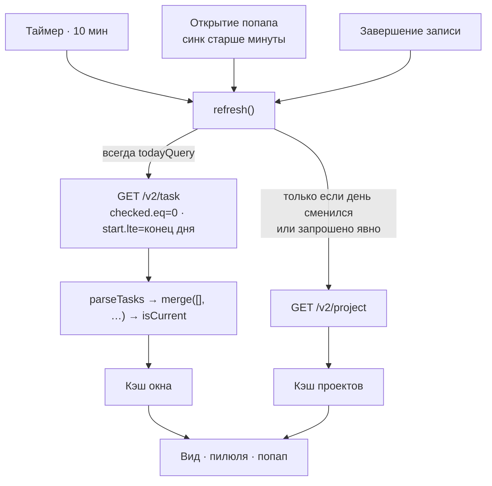

# Отказ от инкремента — Plan

## Goal Capsule

**Задача.** Задача, удалённая вне плагина, остаётся в окне попапа и в счётчике пилюли до
следующей полной выборки — то есть почти сутки. Сделать так, чтобы окно сходилось с
действительностью за время, которое можно назвать вслух.

**Владелец решения.** Игорь. Направление выбрано 07.09: **убрать инкремент**, каждый опрос
идёт полной выборкой.

**Открытых блокеров нет.** Форма ответов API снята живой разведкой; замеры обоих путей
сделаны на живом аккаунте.

## Product Contract

### Что установлено фактом, а не рассуждением

Разведка живого API 07.09 (запросы к рабочему аккаунту, не фикстуры):

| Проверка | Результат |
| --- | --- |
| `fields=…,removed` | **HTTP 400** — поле запросить нельзя |
| Удалённая задача в инкременте, `includeRemoved=true` | приходит и выглядит живой: `checked: 0`, `deleteDate: null`, `deferred: false` |
| То же без `includeRemoved` | приходит так же — параметр ничего не меняет |
| `GET /v2/task/{id}` удалённой | 404 — задача действительно удалена |
| Полная выборка окна | чиста, удалённой в ней нет |

Замеры на том же аккаунте:

| | Полная выборка | Инкремент за 10 минут |
| --- | --- | --- |
| Объём ответа | 1114 байт | 310 байт |
| Время | 520–600 мс | ~570 мс |
| Что отдаёт | ровно окно | всё изменённое, без фильтров окна |

Окно мало по устройству данных: из 192 незавершённых задач заданное начало есть у **трёх**,
а задача без начала в окно не входит вовсе. Полная выборка ограничена окном на стороне
сервера — отсюда полкилобайта.

### Key Decisions

**KD1. Инкремент убирается целиком, а не чинится.**
`session-settled: user-directed` — выбрано владельцем 07.09 из трёх предложенных направлений.
Отвергнуты два: оставить инкремент и делать полную выборку каждый N-й опрос; делать полную
выборку только при открытии попапа (счётчик пилюли врал бы до суток, а он на бару постоянно).

Инкремент экономит около 800 байт раз в десять минут — порядка пяти килобайт в час. Платой
за эту экономию идут: второй путь запроса, параметр `includeRemoved`, который ничего не
делает, признаки `fullFetchPending` и `lastFullFetchDay`, ветвление по виду запроса в
обработчике ответа — и целый класс ошибок «инкремент видит вход в окно, но не выход».
Удаление — третий выход из окна после завершения и переноса, и единственный, который нечем
обнаружить.

**KD2. Мёртвая проверка на `removed` снимается, а не остаётся про запас.**

`isCurrent` отвергает задачу по `task.removed`, а `normalizeTask` пишет туда
`t.removed === true` — то есть всегда `false`, потому что поле не приходит и запросить его
нельзя. Проверка не может сработать ни при каких данных.

Оставлять её «на случай, если API начнёт отдавать» нельзя именно потому, что произошло
здесь: защита выглядела существующей, не будучи ею, и на неё положились. Мёртвая проверка
хуже отсутствующей — она отвечает на вопрос «а защищены ли мы» словом «да».

**KD3. Комментарий, утверждающий неверное, исправляется вместе с кодом.**

`Api.mjs` несёт строку «`removed` is not an allowed field, deletion shows as `deleteDate`».
Первая половина верна, вторая опровергнута разведкой: у удалённой задачи `deleteDate` равен
`null`. Комментарий назвал механизм, которого нет, и следующий читатель поверил бы ему так
же, как поверил автор.

**KD4. Срок схождения называется в README числом, а не подразумевается.**

Пользователь должен знать, за какое время окно сходится с действительностью. Без этого
любая задержка выглядит поломкой, а любая поломка — задержкой.

### Requirements

- **R1.** Каждый опрос сервиса запрашивает окно целиком, с серверными фильтрами окна.
- **R2.** Задача, удалённая вне плагина, покидает окно и счётчик пилюли не позже следующего
  опроса — без перезапуска оболочки.
- **R3.** Открытие попапа при устаревшей синхронизации по-прежнему запрашивает свежие
  данные, поэтому на практике удалённая задача исчезает к моменту, когда пользователь
  смотрит на список.
- **R4.** Из кода уходят: построение инкрементального запроса, перекрытие часов,
  `includeRemoved`, признак отложенной полной выборки и ветвление по виду запроса при
  разборе ответа.
- **R4a.** Список проектов по-прежнему запрашивается раз за локальные сутки **и по
  требованию** — при смене токена, при впервые заданном отсеве проектов и по команде
  `singularity refresh`. Ключ «за сегодня получено» остаётся, но начинает означать проекты.
- **R4b.** Ключ суток проектов записывается по успешному ответу `/v2/project`, а не по
  успеху запроса задач: иначе один неудачный запрос проектов стоит суток без их имён.
- **R5.** Из `isCurrent` и из нормализации уходит признак `removed`. Проверка на
  `deleteDate` остаётся: поле приходит и может быть непустым в сценариях, которые разведка
  не покрывала, — но перестаёт быть единственной надеждой.
- **R6.** Комментарий про `removed`/`deleteDate` заменяется на то, что установлено фактом,
  со ссылкой на разбор.
- **R7.** README называет срок схождения окна и способ ускорить его вручную.
- **R8.** Тесты, покрывающие инкрементальный путь, либо удаляются вместе с ним, либо
  переписываются на полную выборку — ни один не остаётся зелёным «по инерции», проверяя
  функцию, которой нет.
- **R9.** Документы, предписывающие удаляемый механизм, перестают его предписывать:
  разбор `docs/solutions/design-patterns/incremental-sync-window-filter-on-client.md`
  получает врезку о том, что здесь установлено фактом, а статья «Инкремент» в `CONCEPTS.md`
  снимается. `AGENTS.md` отправляет читателя в оба до первой правки — оставить их
  утверждающими опровергнутое значит воспроизвести ровно ту ошибку, которую чинит KD3.
- **R10.** Тихий гейт продолжает работать: при неизменном окне опрос не перестраивает вид
  и не испускает сигнал изменения.

### Acceptance Examples

- **AE1.** Задача удалена в веб-приложении. Не позже следующего опроса она исчезает из
  попапа и из счётчика пилюли; оболочка не перезапускалась.
- **AE2.** Задача удалена, попап открыт спустя более минуты после последней синхронизации.
  Открытие запускает опрос, и задача исчезает на глазах.
- **AE3.** Задача завершена в веб-приложении. Она покидает окно так же, как раньше, —
  поведение при завершении не изменилось.
- **AE4.** Задача создана в веб-приложении с началом на сегодня. Появляется в окне не позже
  следующего опроса.
- **AE5.** Ответ сервера не пришёл (сеть). Попап показывает прежний список и говорит об
  ошибке — как раньше; отказ полной выборки не отличается от прежнего отказа.

### Scope Boundaries

**Не входит:**

- Изменение интервала опроса. Десять минут остаются; если после проверки они окажутся
  велики, это отдельное решение владельца.
- Ленивая догрузка заметок (резидуал SNG-3.1 №6). Он закрывается сам: заметки приезжают для
  трёх задач окна, а не для всех.
- Оповещения от сервера. Вебхуков у API нет, опрос остаётся единственным механизмом.

### Со звёздочкой

- [x] **Проверить поведение на окне в сотню задач.** Закрыто замером 07.09 на 103 задачах
      в окне (101 пробная заведена и удалена).

      | | окно из 3 задач | окно из 103 задач |
      | --- | --- | --- |
      | Ответ полной выборки | 1114 байт | 33 131 байт |
      | Время запроса | 520–600 мс | 655–766 мс |
      | Слияние с прежним набором | — | 0,13 мс |
      | То же, если у каждой задачи заметка 600 символов | — | 0,11 мс |

      Объём вырос в тридцать раз, время — в 1,2 раза: сеть здесь не про размер ответа.
      Запас до `maxCount` (1000) — десятикратный, усечение недостижимо на таком окне.

      Отдельно проверена цена тихого гейта, на которую указала линза эффективности:
      `mergeFull` строит набор из свежих объектов, поэтому короткое замыкание `sameTasks`
      по ссылке не срабатывает и сериализуется всё окно на каждом опросе, а не раз в сутки.
      Механизм назван верно, величина — 0,1–0,2 мс раз в десять минут против 700 мс сети.
      Оптимизация (сравнение по `modifiedAt` вместо полной сериализации) не окупается;
      записана в резидуалы с числами и порогом пересмотра.

      **Исходная формулировка пункта:** Все замеры сделаны на окне из трёх
      задач — это состояние аккаунта, а не свойство плагина. Завести временно две-три сотни
      задач с началом на сегодня, снять объём и время полной выборки, убедиться, что опрос
      не становится заметным. Если становится — назвать порог в README и завести задачу.

      Заодно посмотреть на границу `maxCount`: полная выборка теперь заменяет кэш каждые
      десять минут, а не раз в сутки, поэтому усечённый ответ стирал бы задачи из окна на
      два порядка чаще. Сегодня усечение только пишет предупреждение в журнал.

---

## Planning Contract

### Key Technical Decisions

**KTD1. Полным становится опрос задач, а не весь цикл опроса.**
Инстанцирует KD1; governs R1, R4a.

Сегодня признак `full` управляет двумя вещами сразу: какой запрос уходит за задачами и
запрашивать ли следом список проектов. Сделав полным каждый опрос, мы заодно начали бы
тянуть проекты каждые десять минут — 2815 байт и ещё один круг до сервера (замер 07.09,
33 проекта), при том что проекты меняются раз в недели.

Поэтому одна ветка расщепляется на две независимые: задачи запрашиваются полной выборкой
всегда, проекты — по прежнему правилу «раз за локальные сутки и по требованию».

Оба носителя правила сохраняются, сузившись до проектов: ключ `lastFullFetchDay`
переименовывается в `lastProjectFetchDay`, а признак `fullFetchPending` — в
`projectsFetchPending`. **Признак не удаляется**: сегодня он и есть весь механизм «по
требованию» — его взводят смена токена, впервые заданный отсев проектов (кэш проектов пуст,
и без запроса отсев молча не применится) и команда `singularity refresh`. Убрать его,
оставив только суточный ключ, значит сломать все три случая до следующих суток.

**KTD2. Полной выборке нужна своя функция слияния — иначе тихий гейт умирает молча.**
Governs R1, R10.

Первая редакция этого решения предлагала звать `Api.merge([], incoming, now)` и утверждала,
что тихий гейт не меняется. **Это неверно, и ревью плана поймало это до кода.** `merge`
возвращает прежнюю ссылку только при `sameTasks(cache, next)`, где `cache` — переданный
аргумент. С литералом `[]` сравнение ложно при любом непустом окне, поэтому
`next === root.allTasks` не станет истинным никогда: попап перестраивался бы каждые десять
минут, а в коде осталась бы проверка, которая не может сработать — ровно то, что KD2
объявляет недопустимым.

Поэтому у опроса появляется своя чистая функция: `mergeFull(prev, incoming, now)` строит
набор **только** из пришедшего (кэш не участвует — так удалённая задача и выпадает), но при
совпадении содержимого возвращает саму ссылку `prev`. Существующая `merge` остаётся: её
по-прежнему зовёт отклик записи, где слить одну задачу с кэшем — именно то, что нужно.

**KTD3. `lastRequestStartedAt` уходит вместе с инкрементом.**
Governs R4.

Свойство существует ровно затем, чтобы построить следующий `modifiedSince`. Без
инкремента оно ничего не значит; оставленное, оно стало бы третьим полем, которое пишут и
никогда не читают.

**KTD4. Тесты инкремента удаляются, а не переписываются под новую форму.**
Governs R8.

`incrementalQuery` перестаёт существовать — тест на её параметры не имеет предмета. Тест
`merge: replace by id, drop checked/deleted/removed` в части `removed` проверяет путь,
который больше не может возникнуть: поле не приходит. Он сужается до `checked`/`deleted`,
и это сужение — часть работы, а не потеря покрытия.

### High-Level Technical Design

Было: одна ветка `full` решала оба вопроса сразу, и «сегодня уже выбирали» относилось к
задачам. Стало: задачи запрашиваются одинаково всегда, а суточный ключ остаётся только у
проектов.

---

## Implementation Units

### U1. Api.mjs: убрать инкрементальный запрос и мёртвый признак

- **Goal:** из чистого модуля уходит всё, что обслуживало инкремент, и признак, который
  никогда не приходит.
- **Requirements:** R4, R5, R6, R8, R10; KD1, KD2, KD3, KTD2, KTD3, KTD4.
- **Dependencies:** нет.
- **Files:** `Api.mjs` (изменить), `test/api.test.mjs` (изменить).
- **Approach:**
  1. Удалить `incrementalQuery` и `INCREMENTAL_OVERLAP_MS`.
  2. Из `normalizeTask` убрать поле `removed`; из `isCurrent` — проверку на него.
  3. Заменить комментарий у `TASK_FIELDS`: сказать то, что установлено разведкой, —
     `removed` запросить нельзя, а `deleteDate` у удалённой приходит пустым, поэтому
     удаление обнаруживается не полем, а тем, что полная выборка задачу не возвращает.
  4. Добавить `mergeFull(prev, incoming, now)`: набор строится только из пришедшего и
     фильтруется тем же `isCurrent`, а при совпадении содержимого с `prev` возвращается
     сама ссылка `prev`. Сравнение содержимого — та же `sameTasks`, что уже есть.
  5. Удалить тест на параметры `incrementalQuery`; сузить тест `merge` до `checked` и
     `deleteDate`; убрать `removed` из списка ключей в тесте формы нормализованной задачи
     (утверждение `Object.keys(out[0]).sort()`); проверить, что `TASK_FIELDS` не содержит
     `removed`, — это утверждение остаётся осмысленным и после правки.
- **Patterns to follow:** соседние чистые функции `todayQuery` и `isCurrent`; стиль
  комментариев — почему, а не что.
- **Test scenarios:**
  - Covers R5. `isCurrent` отвергает задачу с `checked !== 0`, с непустым `deleteDate`, с
    `deferred: true` и без `start` — и принимает обычную сегодняшнюю.
  - Covers R5. Задача с полем `removed: true` в исходных данных **принимается**, если
    остальные признаки в норме: поле больше не читается, и тест фиксирует именно это,
    чтобы удаление проверки не выглядело случайной потерей.
  - Covers R8. `TASK_FIELDS` не содержит `removed` — утверждение сохраняется.
  - Covers R4. Модуль не экспортирует `incrementalQuery` и `INCREMENTAL_OVERLAP_MS`.
  - Covers R10. `mergeFull(prev, incoming, now)` возвращает **ту же ссылку** `prev`, когда
    пришедшее совпадает с ней по содержимому, и новый массив, когда не совпадает. Это и есть
    тихий гейт — без теста он умирает молча, что и произошло бы по первой редакции плана.
  - Covers R10. `mergeFull` не тащит в результат задачу, которой нет в пришедшем: кэш из
    двух задач плюс ответ с одной даёт одну. Так удалённая задача и выпадает.
  - Covers R10. `mergeFull` отсеивает по тому же `isCurrent`: завершённая и отложенная в
    результат не попадают.
- **Verification:** `TZ=Asia/Omsk node --test test/api.test.mjs` зелёный; в `Api.mjs` нет
  вхождений `incrementalQuery`, `INCREMENTAL_OVERLAP_MS`, `includeRemoved`, `t.removed` и
  `task.removed` — слово `removed` остаётся только в комментарии, который объясняет, почему
  этого поля нет.

### U2. Service.qml: опрос задач всегда полный, проекты — раз в сутки

- **Goal:** сервис перестаёт выбирать вид запроса, а суточный ключ переезжает на проекты.
- **Requirements:** R1, R2, R3, R4, R4a, R4b, R10; KTD1, KTD2, KTD3.
- **Dependencies:** U1.
- **Files:** `Service.qml` (изменить).
- **Approach:**
  1. В `refresh()` убрать вычисление `full` и выбор параметров: запрос всегда
     `Api.todayQuery(now)`.
  2. Убрать свойства `lastRequestStartedAt` и признак `full` у процесса опроса.
  3. `fullFetchPending` **переименовать** в `projectsFetchPending`, сохранив все три места,
     где он взводится: смена токена, впервые заданный отсев при пустом кэше проектов, IPC
     `refresh()`. Это и есть «по требованию» из R4a — снять его значит сломать все три.
  4. `lastFullFetchDay` переименовать в `lastProjectFetchDay`; после успешного списка задач
     запрашивать `/v2/project`, если взведён `projectsFetchPending` **или** ключ не сегодняшний.
  5. Запись ключа перенести из обработчика задач в **успешную** ветку `projectProc`: сегодня
     он пишется до того, как запрос проектов вообще уйдёт, и после переименования утверждал
     бы «проекты за сегодня получены» ровно в случае, когда их получить не удалось (R4b).
     Значение брать прежним способом — от момента старта запроса задач.
  6. В ветке отброшенного отклика (устарел относительно записи) перенос признака `full`
     заменить на перенос `projectsFetchPending`, если он был взведён.
  7. `Api.merge(taskProc.full ? [] : root.allTasks, …)` заменить на
     `Api.mergeFull(root.allTasks, incoming, now)`. Тихий гейт — `next === root.allTasks` —
     остаётся как есть: он снова становится осмысленным, потому что `mergeFull` возвращает
     прежнюю ссылку при неизменном окне.
- **Patterns to follow:** соседняя координация опроса и записи — предикаты живут в
  `Api.mjs`, QML только присваивает.
- **Test scenarios:** автоматических нет — QML вне досягаемости `node --test`. Проверка
  живая, по Verification Contract.
- **Execution note:** после правки перезапустить оболочку и прочитать её журнал: присваивание
  несуществующему свойству QML принимает молча, и удаление свойства, которое где-то ещё
  читается, проявится только там.
- **Verification:** оболочка загружается без предупреждений плагина; `singularity status`
  отдаёт непустое окно; в `Service.qml` нет вхождений `lastRequestStartedAt`,
  `incrementalQuery`, `taskProc.full`. Отсев проектов, заданный впервые, применяется в тот
  же опрос, а не назавтра.

### U3. README: назвать срок схождения и ручной способ

- **Goal:** пользователь знает, за какое время окно сходится с действительностью и чем
  ускорить это прямо сейчас.
- **Requirements:** R7; KD4.
- **Dependencies:** U2.
- **Files:** `README.md` (изменить).
- **Approach:**
  1. В разделе про попап и опрос сказать: список обновляется раз в десять минут и при
     открытии попапа, если последняя синхронизация старше минуты; поэтому задача,
     изменённая или удалённая вне плагина, отражается не позже этих десяти минут, а
     обычно — сразу при открытии.
  2. Назвать ручной способ: `omarchy-shell singularity refresh`. Его описание в блоке
     команд («force a full fetch») после этой правки перестаёт что-либо различать —
     заменить на то, что команда делает теперь.
- **Test expectation:** none — документация. Утверждений про инкрементальное обновление в
  README нет и сейчас (проверено грепом), поэтому эта часть — проверка, а не правка.
- **Verification:** `bash test/omarchy-plugin-validate "$PWD"` без ошибок; раздел про опрос
  называет и срок, и ручной способ.

### U4. Документы перестают предписывать удалённый механизм

- **Goal:** следующий читатель не получит от репозитория инструкцию строить то, чего нет.
- **Requirements:** R9; KD2, KD3.
- **Dependencies:** U1, U2.
- **Files:** `docs/solutions/design-patterns/incremental-sync-window-filter-on-client.md`
  (изменить), `CONCEPTS.md` (изменить).
- **Approach:**
  1. В разбор добавить врезку с датой и результатом разведки: `removed` запросить нельзя
     (400), `includeRemoved` ничего не меняет, удалённая задача приходит неотличимой от
     живой. Указать, что в этом плагине инкремент снят, и сослаться на SNG-7.
  2. Из примера кода в разборе убрать `includeRemoved` и `task.removed` — это код, которого
     больше нет. **Вывод разбора при этом не отменяется:** «фильтры окна применяются на
     клиенте» верно и сейчас, а его `applies_when` описывает общий случай. Отменяется одна
     предпосылка — что дельта способна показать выход из окна по удалению.
  3. Из `CONCEPTS.md` снять статью «Инкремент»; в статьях «Полная выборка» и «Слияние»
     убрать противопоставление двух путей — путь остался один.
- **Test expectation:** none — документация.
- **Verification:** ни в разборе, ни в словаре не остаётся предписания использовать
  `includeRemoved` или читать `removed`; вывод разбора про клиентский предикат окна на
  месте.

---

## Verification Contract

| Проверка | Команда | Юниты | Признак |
| --- | --- | --- | --- |
| Тесты модуля | `TZ=Asia/Omsk node --test test/api.test.mjs` | U1 | зелёные; число тестов уменьшилось на удалённые, не выросло «за компанию» |
| Манифест и файлы | `bash test/omarchy-plugin-validate "$PWD"` | U1, U2, U3 | код возврата 0 |
| Разбор QML | `qmlformat Service.qml` | U2 | разбирается без ошибок |
| Журнал оболочки | перезапуск, `grep -i "igorkramar.singularity" /tmp/qs.log` | U2 | ни одного предупреждения плагина |
| Удаление вне плагина | удалить задачу через API, наблюдать окно | U2 | исчезает не позже следующего опроса, без перезапуска оболочки |
| Открытие попапа | удалить задачу, открыть попап спустя минуту | U2 | исчезает при открытии |
| Прежнее поведение | завершить и создать задачу через API | U2 | окно ведёт себя как раньше |
| Отказ сети | неверный токен | U2 | попап показывает прежний список и говорит об ошибке |
| Тихий гейт | два опроса подряд без изменений в аккаунте | U1, U2 | второй опрос не перестраивает вид: `changed()` не испускается |
| Проекты по требованию | задать отсев проектов при пустом кэше проектов | U2 | `/v2/project` уходит в тот же опрос, отсев применяется сразу |
| Документы | чтение разбора и словаря | U4 | предписания использовать `includeRemoved`/`removed` не осталось |
| Со звёздочкой | завести ~200 задач с началом на сегодня, замерить | U2 | объём и время полной выборки названы числом; решение о пороге принято; проверено, что ответ не упирается в `maxCount` — усечение теперь стирало бы задачи каждые десять минут, а не раз в сутки |
| CI | джоб `check` на ветке | все | зелёный |

---

## Definition of Done

- Все четыре юнита выполнены, Verification Contract пройден целиком.
- Пункт «со звёздочкой» закрыт замером либо вычеркнут с разбором по существу — «не успели»
  разбором не является.
- Резидуалы, найденные ревью и не исправленные, записаны с причинами.
- Документы, описывающие удалённый механизм, больше его не предписывают.
- README не обещает того, чего плагин не делает.
- MR влит, пайплайн зелёный.

---

## Outstanding Questions

Нет. Направление выбрано, форма ответов API снята фактом, объём работы понятен.
